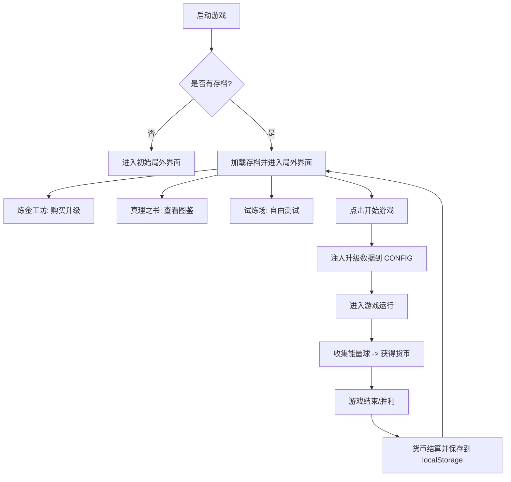

# Echo Alchemist 局外升级模块设计文档

## 一、 核心内容设计

### 1. 升级项规划 (Meta Upgrades)
根据项目架构中的 `CONFIG` 对象，我们将升级项分为以下几类：

| 类别 | 升级项 | 对应 CONFIG 参数 | 效果描述 |
| :--- | :--- | :--- | :--- |
| **属性解锁** | 属性初始权重 | `probabilities` | 增加特定属性（如 bounce, pierce）在游戏开始时的出现概率。 |
| **特殊变异** | 变异解锁 | `specialMutationMult` | 解锁并提升 wind, flying_sword 等高级属性的变异概率。 |
| **同化增强** | 同化概率提升 | `gameplay.assimilationChance` | 提升弹珠碰撞钉子时，钉子被同化为对应属性的概率。 |
| **防线加固** | 防守线下降 | `gameplay.startRows` | 减少初始生成的敌人行数，或增加敌人到达底部的距离。 |
| **资源管理** | 遗物刷新次数 | `gameplay.relicChoiceNum` | 增加遗物选择时的可选数量，或提供重刷机会。 |
| **初始优势** | 初始遗物/禁用 | `RELIC_DB` | 游戏开始时随机获得一个基础遗物，或在池中禁用特定遗物。 |
| **战场环境** | 钉子/特殊槽行数 | `gameplay.rows` / `spSlots` | 增加初始钉子板的行数或特殊功能槽的覆盖范围。 |

### 2. 货币系统 (Currency System)
*   **货币名称**: 能量精粹 (Energy Essence)
*   **获取机制**: 
    *   在“收集阶段”，当弹珠撞击钉子产生能量球（Energy Orb）并飞向连击条时，玩家同时获得等量的货币。
    *   **UI 表现**: 在连击充能条左侧新增一个计数器，实时显示本次运行获得的货币数量。
*   **存储逻辑**: 游戏结束（Game Over）时，将本次运行获得的货币汇总到全局存档中。

---

## 二、 UI 与游戏循环设计

### 1. 局外主界面 (Meta Hub)
需要一个新的全屏 UI 层，在 `index.html` 中通过 `display: none/block` 切换。
*   **资源查看**: 顶部状态栏显示当前拥有的“能量精粹”总量。
*   **导航菜单**: 侧边或底部标签栏，包含：
    *   **炼金工坊 (Shop)**: 局外升级购买界面，采用网格或树状布局。
    *   **真理之书 (Library)**: 包含游戏图鉴、属性说明、遗物列表。
    *   **试炼场 (Playground)**: 进入测试模式。
    *   **启程 (Start)**: 开始正式游戏。
*   **视觉风格**: 延续现有的暗色调 + 霓虹色属性高亮风格。

### 2. 游戏循环 (Game Loop) 流程图

### 2. 游戏循环 (Game Loop)
1.  **启动**: 进入局外主界面。
2.  **整备**: 在商店购买升级，查看图鉴。
3.  **开始**: 点击“开始新游戏”，将局外升级数据注入 `CONFIG`。
4.  **运行**: 正常游戏，收集能量球获取货币。
5.  **结算**: 游戏结束，结算货币，返回局外主界面。

---

## 三、 技术实现要点
1.  **持久化**: 使用 `localStorage` 存储玩家的升级进度和货币。
2.  **注入机制**: 在 `Game.init()` 时，根据 `localStorage` 的数据动态修改 `CONFIG` 的副本。
3.  **UI 路由**: 扩展 `UIManager` 类，增加 `switchMetaTab` 方法处理局外界面的切换。
