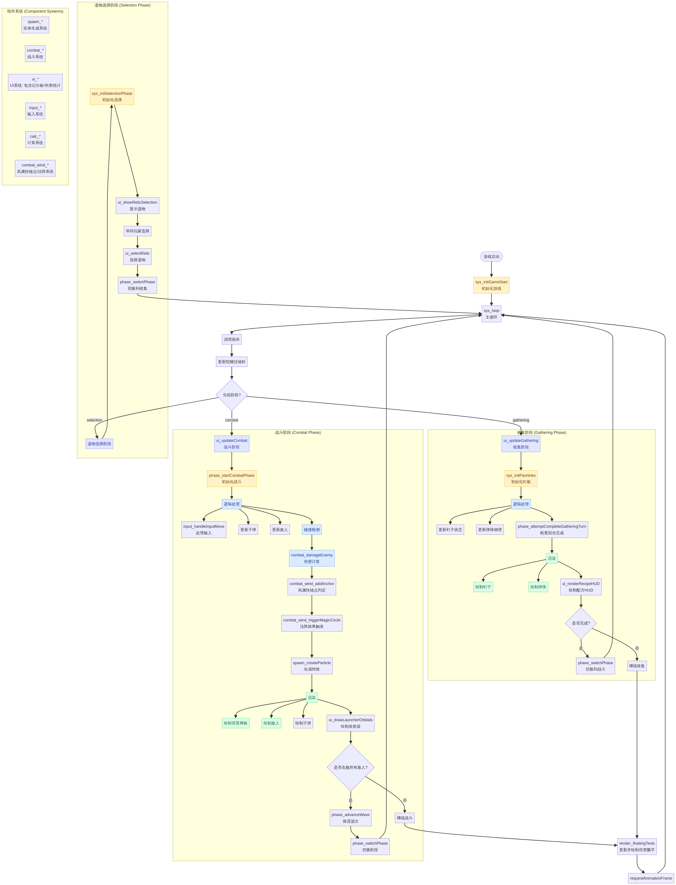
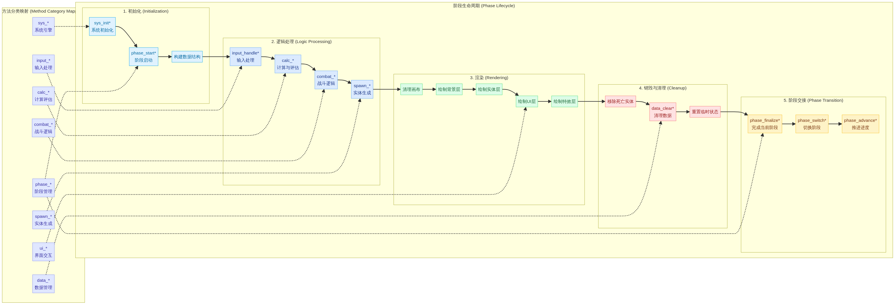

# Echo Alchemist (回聲煉金師) - 代码结构化索引 v2.0

本项目是一个基于 HTML5 Canvas 和 JavaScript 开发的单文件 Roguelike 游戏。为了方便 AI Agent 和开发者理解、编辑这个超过 11,000 行的超长文件，特建立此结构化索引 v2.0。

此版本引入了统一的**属性系统方法论**，并对代码进行了初步的规范化重构。

## 1. 属性系统方法论与知识图谱

### 1.1 设计原则

- **语义化命名**: 内部标识符必须反映其功能，而非视觉表现 (e.g., `redStripe` 已重构为 `explosive`)。
- **数据驱动**: 游戏核心参数由结构化的数据对象定义，避免硬编码。
- **分类清晰**: 每个属性都归属于一个明确的分类，以决定其行为模式。

### 1.2 属性分类体系

我们为所有弹珠/子弹的属性划定了五大类别，以规范其交互逻辑和数据结构。


| 分类 (Category) | 类型 (Type) | 描述 | 示例 |
| :--- | :--- | :--- | :--- |
| **基础 (Base)** | `base` | 游戏开始时的默认属性。 | `white` (纯净) |
| **物理 (Physical)** | `stackable` | 可通过碰撞累加数值，影响物理行为。 | `bounce`, `pierce`, `scatter` |
| **元素 (Elemental)** | `stackable` | 可累加数值，附加元素伤害或效果。 | `cryo`, `pyro`, `lightning` |
| **特殊 (Special)** | `marble_bound` | 与弹珠类型绑定，不可叠加，提供独特机制。 | `explosive`, `rainbow`, `matryoshka` |
| **高级 (Advanced)** | `evolution` | 由其他属性组合进化而来，通常更强大。 | `flying_sword`, `wind` |
| **功能 (Functional)** | `stackable` | 特殊的功能性攻击，可叠加层数。 | `laser` |

### 1.3 属性交互流程

下图展示了属性在“收集”和“战斗”两个阶段中如何流转、交互和演变。


## 2. 核心架构 (Core Architecture)

游戏采用面向对象的设计，逻辑高度解耦。

| 类名 | 职责描述 | 关键方法 |
| :--- | :--- | :--- |
| **`Game`** | 游戏引擎核心，管理状态、循环、输入及全局逻辑。 | `switchPhase`, `loop`, `damageEnemy`, `spawnEnemyRow` |
| **`Enemy`** | 敌人逻辑，处理 AI、血量、词缀及受击反馈。 | `takeDamage`, `executeTurnAction`, `draw` |
| **`Projectile`** | 战斗弹丸，处理移动、碰撞及特殊攻击逻辑。 | `update`, `onHit`, `performSlashAttack` |
| **`DropBall`** | 收集阶段弹珠，处理物理模拟与钉板交互。 | `handlePegInteraction`, `update`, `draw` |
| **`SoundManager`** | 音频引擎，基于 Web Audio API 合成音效。 | `playEffect`, `playTone`, `playHit` |
| **`UIManager`** | UI 状态管理，处理 DOM 更新与交互。 | `updateSkillBar`, `showEnemyInfo`, `switchTab` |
| **`FloatingText`** | 浮动文字特效类，用于显示伤害数字和得分。 | `update`, `draw` |

## 3. 全局配置与数据库 (Global Config & DB)

所有的平衡性调整和视觉规范都集中在以下常量中：

*   **`CONFIG` (Line 1129)**: 
    *   `ui`: 颜色与图标定义。
    *   `physics`: 重力、摩擦力、弹珠半径等物理参数。
    *   `balance`: 敌人血量成长、词缀触发概率、伤害系数。
    *   `gameplay`: 网格大小、波次规则、遗物出现间隔。
*   **`RELIC_DB` (Line 1327)**: 遗物系统定义，包含 `id`, `name`, `effect`, `rarity` 等。
*   **`SKILL_DB` (Line 1384)**: 玩家主动技能定义，包含消耗、逻辑 ID (`methodId`) 及参数。

## 4. 开发与调试指南 (Dev & Debug)

*   **性能优化**: 游戏使用了 `requestAnimationFrame` 驱动主循环，并通过 `timeScale` 支持慢动作效果。
*   **视觉特效**: 结合了 CSS `@keyframes` (Line 43+) 和 Canvas 绘图。
*   **调试建议**: 
    *   修改 `CONFIG.balance` 可快速测试不同难度。
    *   搜索 `class Game` 下的 `setupInputs` 可调整交互逻辑。

---

*此文档由 AI Agent 自动生成并迭代，旨在作为大型代码库的“第二大脑”索引。*


## 5. Game 类方法命名规范 (v2.1)

为了提升代码的可读性和可维护性，`Game` 类中的所有方法都已按照其逻辑职责进行了重命名，并添加了模块前缀。

| 模块前缀 | 职责范围 | 示例方法 |
| :--- | :--- | :--- |
| `sys_` | 系统/引擎层（初始化、循环、调整） | `sys_loop`, `sys_initGame` |
| `phase_` | 阶段管理（切换、状态检查） | `phase_switch`, `phase_advanceWave` |
| `spawn_` | 实体生成（敌人、掉落物、特效） | `spawn_enemyRow`, `spawn_createParticle` |
| `combat_` | 战斗逻辑（伤害计算、技能释放） | `combat_damageEnemy`, `combat_fireLaser` |
| `ui_` | 界面交互（更新、弹窗、浮动文字） | `ui_updateAll`, `ui_showRelicSelection` |
| `input_` | 输入处理（鼠标、触摸、陀螺仪） | `input_handleInputMove`, `input_handleOrientation` |
| `calc_` | 计算与评估 | `calc_evaluateAndAdjustDifficulty` |
| `data_` | 数据管理（记录、统计） | `data_clearProjectiles` |

此外，所有重命名后的方法都已添加了 **JSDoc 注释模板**，方便 IDE 进行识别和提示。

## 6. 重构待办清单 (Refactoring TODO)

在本次重构中，我们识别出以下可以进一步解耦的模块。详细信息请参见 `REFACTOR_TODO.md` 文件。

- **UI 管理器 (`UIManager`)**: 将所有 `ui_` 方法整合进 `UIManager` 类。
- **实体工厂 (`EntityManager`)**: 将所有 `spawn_` 和 `create_` 方法整合进一个工厂类。
- **输入处理器 (`InputHandler`)**: 将所有 `input_` 方法封装成独立的输入处理模块。
- **战斗逻辑管理器 (`CombatManager`)**: 将所有 `combat_` 方法剥离到专门的战斗管理器中。


## 7. 游戏主循环架构 (Game Loop Architecture)

为了更直观地理解游戏的运行流程，我们梳理了从主循环到各个阶段再到组件的完整调用链。

### 7.1 完整调用链

下图展示了游戏从启动到主循环，再到不同阶段（收集、战斗、选择）的完整流程：



### 7.2 阶段生命周期

每个游戏阶段都遵循一个标准的生命周期，从初始化到销毁，再到下一个阶段的交接。下图展示了这个生命周期以及它与方法分类的映射关系：



这个架构图清晰地展示了：
- **`sys_loop`** 是所有逻辑的入口。
- 游戏的核心是 **收集 (Gathering)** 和 **战斗 (Combat)** 两个阶段的循环。
- 每个阶段都包含 **初始化、逻辑处理、渲染、销毁** 等生命周期步骤。
- 我们之前定义的 **方法分类**（如 `combat_*`, `ui_*`）与这些生命周期步骤一一对应。


## 8. 二级命名规范与渲染抽象 (v2.2)

本次优化进一步细化了 `Game` 类中的方法命名，并抽象了渲染流程，使代码结构更接近标准的 ECS (Entity-Component-System) 架构。

### 8.1 二级命名规范

针对与特定属性系统强关联的方法，引入了**二级命名空间**，以 `模块_系统_方法` 的结构进行命名。

| 旧命名 | 新命名 | 职责 |
| :--- | :--- | :--- |
| `spawn_addSonSword` | `combat_flyingSword_addSon` | 飞剑系统：生成子飞剑 |
| `combat_assignSwordTarget` | `combat_flyingSword_assignTarget` | 飞剑系统：分配目标 |
| `combat_fireLaser` | `combat_laser_fire` | 激光系统：发射激光 |
| `combat_processLaserPenetration` | `combat_laser_processPenetration` | 激光系统：处理穿透 |
| `spawn_triggerLightningChain` | `combat_lightning_triggerChain` | 闪电系统：触发闪电链 |
| `calc_processSingleEnemyTurn` | `phase_enemy_processTurn` | 敌人AI：处理单回合逻辑 |
| `ui_updateCombat` | `phase_combat_update` | 战斗阶段：更新逻辑 |
| `ui_updateGathering` | `phase_gathering_update` | 收集阶段：更新逻辑 |
| `ui_toggleDamagePanel` | `ui_toggleDamagePanel` | 切换伤害统计面板（记分板） |
| `ui_updateDamageStats` | `ui_updateDamageStats` | 更新伤害统计数据 |
| `combat_wind_addAnchor` | `combat_wind_addAnchor` | 添加风属性锚点并处理法阵逻辑 |
| `combat_wind_triggerMagicCircle` | `combat_wind_triggerMagicCircle` | 判定并触发风属性法阵效果 |

### 8.2 渲染流程抽象

`sys_loop` 中的渲染逻辑已被抽象为独立的 `render_*` 方法，极大地提升了主循环的可读性。

| 新方法 | 职责 | 原始位置 |
| :--- | :--- | :--- |
| `render_clearCanvas` | 清理画布并绘制背景色 | `sys_loop` 内部 |
| `render_background` | 绘制背景网格（仅非战斗阶段） | `sys_loop` 内部 |
| `render_floatingTexts` | 更新并绘制全局浮动文字 | `sys_loop` 内部 |
| `render_combat_launcherOrbitals` | 绘制发射器属性轨道 | `phase_combat_update` 内部 |

**重构后的 `sys_loop` 结构**：

```javascript
sys_loop() {
    // 1. 基础渲染准备
    this.render_clearCanvas();
    // 2. 全局状态更新 (倾斜)
    // 3. 背景层渲染
    this.render_background();
    // 4. 阶段逻辑与渲染分发
    this.phase_gathering_update(timeScale); // 或 phase_combat_update
    // 5. 特效与文字层渲染
    this.render_floatingTexts(timeScale);
    // 6. 下一帧请求
    requestAnimationFrame(() => this.sys_loop());
}
```

## 9. 风属性锚点法阵机制 (Wind Anchor System)

风属性（Wind）引入了一套基于空间几何判定的“法阵”系统，为战斗增加了极高的策略深度。

### 9.1 锚点生成规则

- **触发条件**: 仅在多重射击（Multicast）的**最后一颗**子弹反弹（墙壁或敌人）时产生。
- **数量限制**: 场上最多存在 **4 个** 锚点。
- **更替机制**: 当第 5 个锚点生成时，最旧的锚点会消失，并在消失位置触发一次小范围弹珠伤害。

### 9.2 法阵判定逻辑

当场上凑齐 4 个锚点时，系统会根据它们形成的矩形区域（Bounding Box）进行判定：

| 判定维度 | 分类 | 判定标准 |
| :--- | :--- | :--- |
| **面积 (Area)** | 小面积 | 面积 < 15,000 像素 |
| | 大面积 | 面积 >= 15,000 像素 |
| **形状 (Shape)** | 正方形 | 长宽比 < 1.5 |
| | 长方形 | 长宽比 >= 1.5 |

### 9.3 法阵效果矩阵

根据面积、形状以及子弹携带的**次要属性**（爆炸或光），法阵会触发以下 9 种效果之一：

| 区域特征 | 纯风属性 (Wind) | 风 + 爆炸 (Wind + Explosive) | 风 + 光 (Wind + Laser) |
| :--- | :--- | :--- | :--- |
| **小面积** | **小旋风**: 多次伤害，每次令敌人温度 * 1.1 | **不稳定气流**: 持续至下回合，子弹经过触发爆炸 | **黑洞**: 范围内敌人直接移除 |
| **大面积 + 正方形** | **大旋风**: 持续3回合，可吸收温度变为火/冰旋风 | **内爆**: 造成伤害并将敌人向四周推动 1 格 | **屏障**: 形成封闭空间，子弹在内部持续反弹 |
| **大面积 + 长方形** | **风道**: 沿中轴线造成多次伤害并转移敌人温度 | **冲击波**: 沿中轴线发射，造成伤害并推离敌人 | **离子风暴**: 沿中轴线照射，产生高额闪电伤害 |
