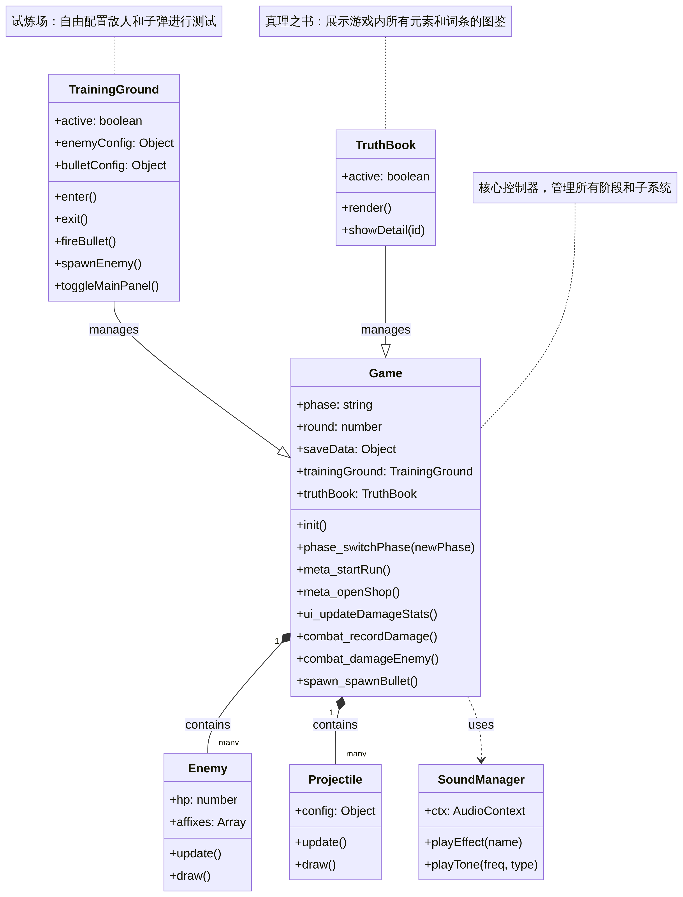

# Echo Alchemist (回聲煉金師) - 代码结构化索引 v4.0

本项目是一个基于 HTML5 Canvas 和 JavaScript 开发的**模块化 Roguelike 游戏**。

> [!IMPORTANT]
> **多文件架构说明**: 为了提升代码的可维护性和扩展性，项目已从单文件架构迁移至模块化架构。核心逻辑已拆分至 `src/` 目录下的多个模块中。

## 1. 项目架构 (Project Architecture)

游戏采用面向对象的设计，逻辑高度解耦。核心控制器 `Game` 类管理着多个子系统和功能模块。

### 1.1 目录结构与核心模块

| 路径 | 职责描述 | 关键内容 |
| :--- | :--- | :--- |
| **`index.html`** | 游戏入口与 UI 结构。 | 包含 HTML 骨架、CSS 样式及模块化脚本导入。 |
| **`src/core.js`** | 游戏引擎核心。 | `Game` 类、游戏循环 (`sys_loop`)、状态管理及音频管理。 |
| **`src/config.js`** | 全局配置中心。 | `CONFIG` 对象、`RELIC_DB`、`SKILL_DB` 及平衡性参数。 |
| **`src/entities.js`** | 游戏实体定义。 | `Enemy`、`Projectile`、`Particle` 等基础类。 |
| **`src/systems.js`** | 业务逻辑子系统。 | `TrainingGround` (试炼场)、`TruthBook` (真理之书) 及 UI 交互逻辑。 |

### 1.2 核心类说明

| 类名 | 职责描述 | 关键方法 |
| :--- | :--- | :--- |
| **`Game`** | 游戏引擎核心，管理状态、循环、输入及全局逻辑。 | `sys_loop`, `phase_switchPhase`, `combat_damageEnemy` |
| **`TrainingGround`** | 试炼场模块，提供自由配置敌人和子弹的测试环境。 | `enter`, `exit`, `fireBullet`, `spawnEnemy` |
| **`TruthBook`** | 真理之书模块，展示游戏内所有元素、词条和属性的图鉴。 | `render`, `showDetail`, `ui_openTruthBook` |
| **`Enemy`** | 敌人逻辑，处理 AI、血量、词缀及受击反馈。 | `update`, `draw`, `advance` |
| **`Projectile`** | 战斗弹丸，处理移动、碰撞及特殊攻击逻辑。 | `update`, `draw`, `destroy` |
| **`SoundManager`** | 音频引擎，基于 Web Audio API 合成音效。 | `playEffect`, `playTone`, `resume` |

## 2. 功能模块详解

### 2.1 首页与局外成长 (Meta Progression)
游戏现在拥有一个完整的首页（`phase-meta`），作为玩家的行动中心：
- **开始炼成**: 初始化新的游戏循环。
- **炼金工坊 (Workshop)**: 使用“能量精粹”进行局外永久升级，包括属性权重解锁、初始属性增强、防线加固等。
- **数据持久化**: 玩家的升级进度和货币通过 `saveData` 对象进行管理。

### 2.2 试炼场 (Training Ground)
一个独立的测试模式，允许玩家：
- **自定义子弹**: 自由调整伤害、弹跳、穿透、元素层数等参数。
- **配置敌人**: 设置敌人血量并注入各种词缀（如精英、护盾、分身等）。
- **实时统计**: 提供 DPS 监测和总伤害统计，方便测试不同属性组合的强度。

### 2.3 真理之书 (Truth Book)
游戏内的百科全书，包含：
- **属性图鉴**: 详细解释每种属性（火、冰、雷、风、飞剑等）的效果。
- **词缀说明**: 介绍敌人可能携带的特殊能力。
- **演示引擎**: 在图鉴内提供实时的视觉演示。

### 2.4 伤害统计看板 (Damage Analytics)
经过深度优化的伤害统计系统，解决了视觉混淆并提升了数据精度：
- **子弹级区分**: 不再聚合全回合数据，而是按射击顺序（Shot #1, Shot #2...）独立展示每发子弹的伤害贡献。
- **横轴比例缩放**: 进度条长度根据该伤害类型占本发子弹最大伤害类型的比例进行动态缩放，直观反映伤害量级。
- **颜色与来源区分**: 
    - **反弹 (Bounce)** 颜色调整为绿色，与游戏内视觉保持一致，并与黄色的 **散射 (Scatter)** 明确区分。
    - **来源标记**: 使用斜纹纹理标记“散射”产生的伤害，同时保留其所属的伤害类型颜色。
- **历史回溯**: 支持查看当前回合及过往回合的详细伤害分布。

## 3. 属性系统与规则

### 3.1 属性分类体系

| 分类 (Category) | 描述 | 示例 |
| :--- | :--- | :--- |
| **基础 (Base)** | 默认属性。 | `damage` (基础伤害) |
| **物理 (Physical)** | 影响物理行为。 | `bounce`, `pierce`, `scatter` |
| **元素 (Elemental)** | 附加元素伤害或效果。 | `cryo` (冰), `pyro` (火), `lightning` (雷) |
| **高级 (Advanced)** | 独特机制或进化属性。 | `flying_sword` (飞剑), `wind` (风), `laser` (激光) |

### 3.2 详细规则文档
- [**风属性系统逻辑**](RULES_WIND_V2.md): 锚点生成、几何判定及法阵效果。
- [**子母剑系统规则**](RULES_FLYING_SWORD.md): 飞剑获取、升级及战斗行为。

## 4. 开发与配置 (Development & Config)

- **模块化开发**: 逻辑已拆分，修改功能时请前往对应的 `src/*.js` 文件。
- **`CONFIG`**: 核心平衡性参数、UI 定义及物理常数，位于 `src/config.js`。
- **`META_SHOP_CONFIG`**: 炼金工坊的升级项、价格曲线及效果定义。
- **`RELIC_DB` & `SKILL_DB`**: 遗物与主动技能数据库。

---
*此文档由 AI Agent 根据最新代码库自动更新，旨在提供最准确的项目架构索引。*
