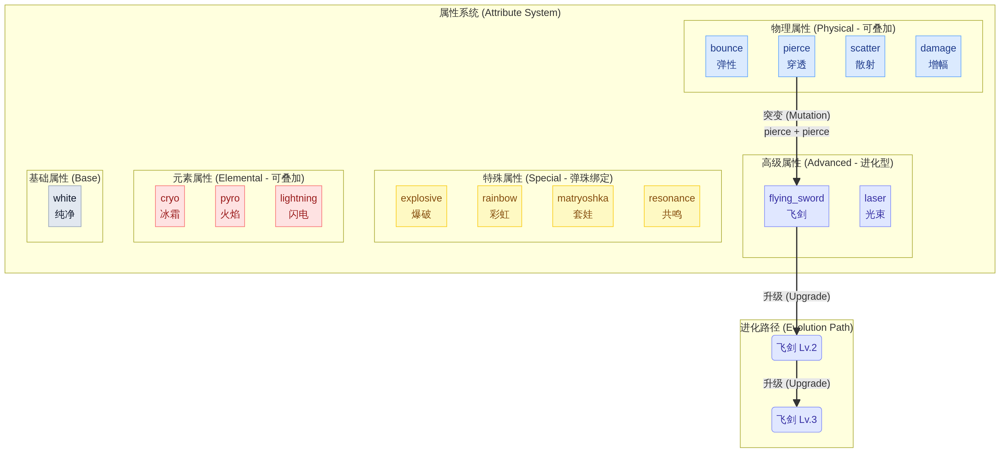
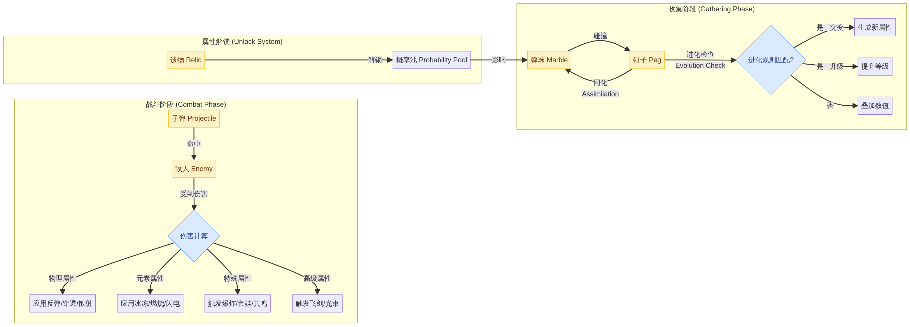

# Echo Alchemist (回聲煉金師) - 代码结构化索引 v2.0

本项目是一个基于 HTML5 Canvas 和 JavaScript 开发的单文件 Roguelike 游戏。为了方便 AI Agent 和开发者理解、编辑这个超过 11,000 行的超长文件，特建立此结构化索引 v2.0。

此版本引入了统一的**属性系统方法论**，并对代码进行了初步的规范化重构。

## 1. 属性系统方法论与知识图谱

### 1.1 设计原则

- **语义化命名**: 内部标识符必须反映其功能，而非视觉表现 (e.g., `redStripe` 已重构为 `explosive`)。
- **数据驱动**: 游戏核心参数由结构化的数据对象定义，避免硬编码。
- **分类清晰**: 每个属性都归属于一个明确的分类，以决定其行为模式。

### 1.2 属性分类体系

我们为所有弹珠/子弹的属性划定了五大类别，以规范其交互逻辑和数据结构。

| 分类 (Category) | 类型 (Type) | 描述 | 示例 |
| :--- | :--- | :--- | :--- |
| **基础 (Base)** | `base` | 游戏开始时的默认属性。 | `white` (纯净) |
| **物理 (Physical)** | `stackable` | 可通过碰撞累加数值，影响物理行为。 | `bounce`, `pierce`, `scatter` |
| **元素 (Elemental)** | `stackable` | 可累加数值，附加元素伤害或效果。 | `cryo`, `pyro`, `lightning` |
| **特殊 (Special)** | `marble_bound` | 与弹珠类型绑定，不可叠加，提供独特机制。 | `explosive`, `rainbow`, `matryoshka` |
| **高级 (Advanced)** | `evolution` | 由其他属性组合进化而来，通常更强大。 | `flying_sword`, `laser` |

### 1.3 属性交互流程

下图展示了属性在“收集”和“战斗”两个阶段中如何流转、交互和演变。

## 2. 核心架构 (Core Architecture)

游戏采用面向对象的设计，逻辑高度解耦。

| 类名 | 职责描述 | 关键方法 |
| :--- | :--- | :--- |
| **`Game`** | 游戏引擎核心，管理状态、循环、输入及全局逻辑。 | `switchPhase`, `loop`, `damageEnemy`, `spawnEnemyRow` |
| **`Enemy`** | 敌人逻辑，处理 AI、血量、词缀及受击反馈。 | `takeDamage`, `executeTurnAction`, `draw` |
| **`Projectile`** | 战斗弹丸，处理移动、碰撞及特殊攻击逻辑。 | `update`, `onHit`, `performSlashAttack` |
| **`DropBall`** | 收集阶段弹珠，处理物理模拟与钉板交互。 | `handlePegInteraction`, `update`, `draw` |
| **`SoundManager`** | 音频引擎，基于 Web Audio API 合成音效。 | `playEffect`, `playTone`, `playHit` |
| **`UIManager`** | UI 状态管理，处理 DOM 更新与交互。 | `updateSkillBar`, `showEnemyInfo`, `switchTab` |

## 3. 全局配置与数据库 (Global Config & DB)

所有的平衡性调整和视觉规范都集中在以下常量中：

*   **`CONFIG` (Line 1129)**: 
    *   `ui`: 颜色与图标定义。
    *   `physics`: 重力、摩擦力、弹珠半径等物理参数。
    *   `balance`: 敌人血量成长、词缀触发概率、伤害系数。
    *   `gameplay`: 网格大小、波次规则、遗物出现间隔。
*   **`RELIC_DB` (Line 1327)**: 遗物系统定义，包含 `id`, `name`, `effect`, `rarity` 等。
*   **`SKILL_DB` (Line 1384)**: 玩家主动技能定义，包含消耗、逻辑 ID (`methodId`) 及参数。

## 4. 开发与调试指南 (Dev & Debug)

*   **性能优化**: 游戏使用了 `requestAnimationFrame` 驱动主循环，并通过 `timeScale` 支持慢动作效果。
*   **视觉特效**: 结合了 CSS `@keyframes` (Line 43+) 和 Canvas 绘图。
*   **调试建议**: 
    *   修改 `CONFIG.balance` 可快速测试不同难度。
    *   搜索 `class Game` 下的 `setupInputs` 可调整交互逻辑。

---

*此文档由 AI Agent 自动生成并迭代，旨在作为大型代码库的“第二大脑”索引。*
