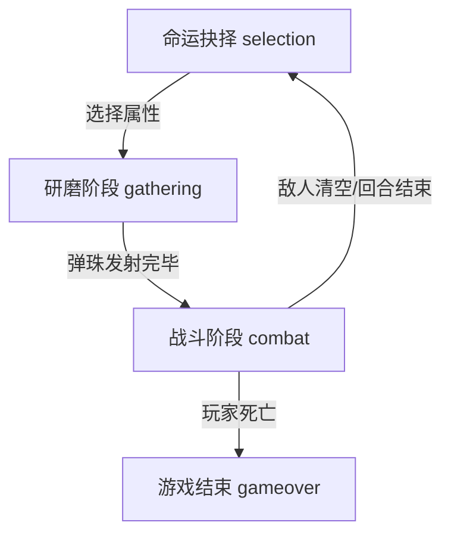

# 游戏主流程阶段说明 (Game Flow Phases)

本文档定义了 `Echo Alchemist` 的核心游戏循环阶段，不包括真理之书、试炼场等辅助系统。

## 阶段概览 (Phases Overview)

游戏主流程在以下三个核心阶段中循环：

---

## 1. 命运抉择 (Selection Phase)
**阶段标识**: `selection`
- **描述**: 玩家在每轮开始前选择初始属性或遗物。
- **核心函数**:
    - `ui_showRelicSelection()`: 弹出遗物选择界面。
    - `phase_switchPhase('selection')`: 切换至此阶段。

## 2. 研磨阶段 (Gathering Phase)
**阶段标识**: `gathering`
- **描述**: 弹珠台玩法，玩家发射弹珠碰撞钉子以收集/变异属性，填充弹药队列。
- **核心函数**:
    - **初始化**: `phase_gathering_initPachinko()` (重置钉子板、生成特殊槽位)。
    - **逻辑更新**: `phase_gathering_update()` (处理 3D 倾斜效果、背景渲染)。
    - **交互**: `spawn_dropBall()` (玩家点击发射弹珠)。
    - **结束判定**: 当所有弹珠停止运动且发射次数用尽时，触发 `phase_startCombatPhase()`。

## 3. 战斗阶段 (Combat Phase)
**阶段标识**: `combat`
- **描述**: Roguelike 战斗，玩家使用研磨阶段获得的弹药队列抵御敌人。
- **核心函数**:
    - **初始化**: `phase_startCombatPhase()` (重置战斗 UI、准备弹药队列)。
    - **逻辑更新**: `phase_combat_update()` (处理子剑生成、蓄力发射逻辑)。
    - **发射逻辑**: `combat_fireNextShot()` (从队列中取出并射出下一发弹药)。
    - **伤害处理**: `combat_reportDamage()` (记录伤害，触发 DDA 评估)。
    - **结束判定**: 
        - 胜利: `phase_switchPhase('selection')`。
        - 失败: `phase_switchPhase('gameover')`。

---
**注意**: AI 在修改阶段跳转逻辑时，必须确保状态切换的完整性（初始化 -> 更新 -> 销毁）。
