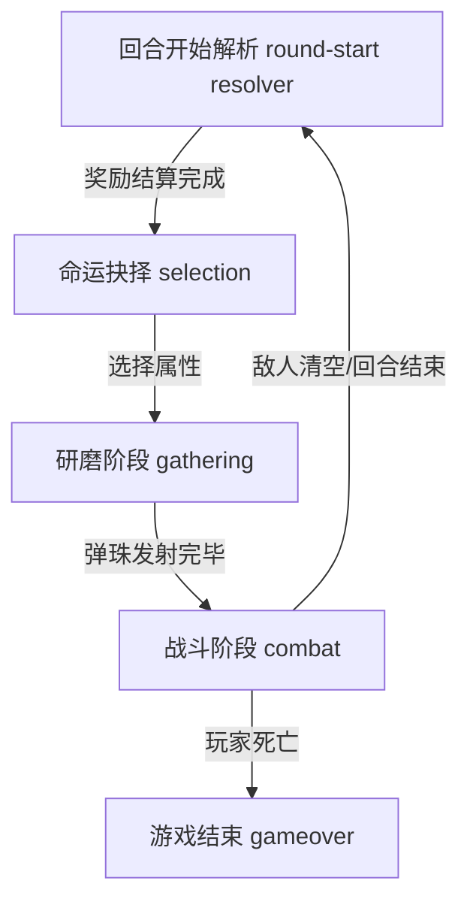

# 游戏主流程阶段说明 (Game Flow Phases)

本文档定义了 `Echo Alchemist` 的核心游戏循环阶段，不包括真理之书、试炼场等辅助系统。

## 阶段概览 (Phases Overview)

游戏主流程在以下三个核心阶段中循环：

---

## 1. 回合开始解析 (Round-Start Resolver)
- **描述**: 统一结算 `pendingRoundStartRewards` 中登记的遗物或精华；首个遗物、非 Boss 敌人掉落与刷新恢复都先经过这一层。
- **核心函数**:
    - `sys_queueRoundStartReward()`: 记录待结算奖励。
    - `sys_startRoundStartResolver()`: 顺序处理精华并在需要时打开遗物选择。
    - `sys_continueRoundStartResolver()`: 遗物选择关闭后继续解析剩余奖励。

## 2. 命运抉择 (Selection Phase)
**阶段标识**: `selection`
- **描述**: 玩家在 round-start resolver 结算完成后选择初始属性。
- **核心函数**:
    - `ui_showRelicSelection()`: 在 round-start resolver 需要时弹出遗物选择界面。
    - `phase_switchPhase('selection')`: 切换至此阶段。

## 3. 研磨阶段 (Gathering Phase)
**阶段标识**: `gathering`
- **描述**: 弹珠台玩法，玩家发射弹珠碰撞鑉子以收集/变异属性，填充弹药队列。鑉盘采用基于 Galton Board 理论的物理引擎，弹珠碰撞具备角动量、速度依赖弹性和 Magnus 效应。
- **核心函数**:
    - **初始化**: `phase_gathering_initPachinko()` (重置鑉子板、生成特殊槽位、存储布局类型到 `currentLayout`)。
    - **逻辑更新**: `phase_gathering_update()` (处理 3D 倾斜效果、背景渲染、落点热力图绘制)。
    - **交互**: `spawn_dropBall()` (玩家点击发射弹珠，同时注入布局物理参数并计算落点分布)。
    - **结束判定**: 当所有弹珠停止运动且发射次数用尽时，触发 `phase_startCombatPhase()`。
- **物理引擎** (`src/plinko_physics.js`):
    - **布局专属物理**: 每种布局（default/triangle/diamond/sparse/mirror_sync/wide_narrow）拥有独立的弹性、摩擦、角动量转移和 Magnus 强度参数。
    - **概率分布预测**: 基于二项分布 B(n, p) 计算弹珠落点概率，并根据布局类型施加修正（收敛分布/双峰/均匀/对称/多峰）。
    - **落点热力图**: 弹珠发射后在鑉盘底部显示概率分布可视化，帮助玩家理解当前布局的落点特征。

## 4. 战斗阶段 (Combat Phase)
**阶段标识**: `combat`
- **描述**: Roguelike 战斗，玩家使用研磨阶段获得的弹药队列抵御敌人。
- **核心函数**:
    - **初始化**: `phase_startCombatPhase()` (重置战斗 UI、准备弹药队列)。
    - **逻辑更新**: `phase_combat_update()` (处理子剑生成、蓄力发射逻辑)。
    - **发射逻辑**: `combat_fireNextShot()` (从队列中取出并射出下一发弹药)。
    - **伤害处理**: `combat_reportDamage()` (记录伤害，触发 DDA 评估)。
    - **结束判定**: 
        - 胜利: `phase_finalizeRound()` 存档后进入 `sys_startRoundStartResolver()`。
        - 失败: `phase_switchPhase('gameover')`。

---
**注意**: AI 在修改阶段跳转逻辑时，必须确保状态切换的完整性（初始化 -> 更新 -> 销毁）。
