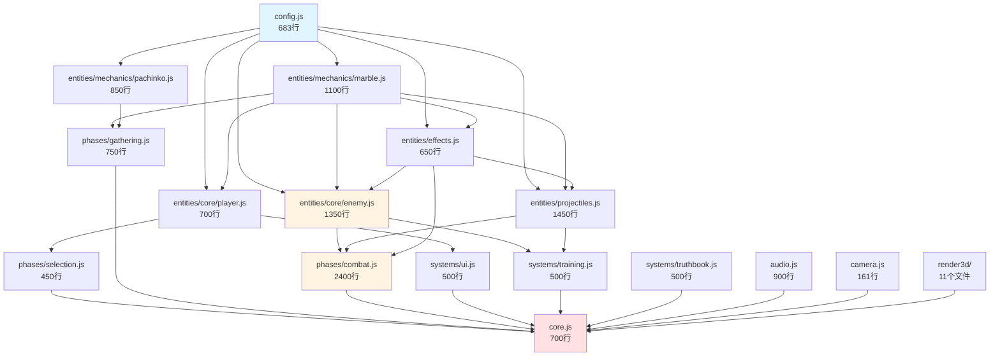

# Echo Alchemist 代码结构与文件拆分评估报告

**评估日期**: 2026-01-03  
**评估人**: Manus AI Agent  
**项目仓库**: gdszyy/echo-alchemist-v2-1766564886

---

## 执行摘要

本报告针对Echo Alchemist项目中的两个超大文件（`core.js` 8393行，`entities.js` 6073行）进行了深度分析，识别了代码组织中的关键问题，并提供了具体的拆分方案。评估结果显示，当前代码结构虽然功能完整，但存在**单文件过大**、**职责边界模糊**、**AI开发困难**等问题。通过合理拆分，可将文件数量控制在**12-15个**，单文件行数控制在**500-2500行**，显著提升开发效率和代码可维护性。

**关键指标**:
- **当前总行数**: 16,798行（仅计算src/*.js）
- **拆分后文件数**: 12-15个（不含render3d子系统）
- **预计工作量**: 18-24小时
- **风险等级**: 中等

---

## 一、当前结构分析

### 1.1 文件概览

| 文件 | 行数 | 类数量 | 主要职责 | 问题严重度 |
|------|------|--------|----------|-----------|
| `core.js` | 8393 | 2 (SoundManager, Game) | 游戏主循环、阶段管理、战斗逻辑、UI渲染 | **高** |
| `entities.js` | 6073 | 22 | 所有实体类定义 | **高** |
| `systems.js` | 1488 | 3 (UIManager, TrainingGround, TruthBook) | UI系统、试炼场、图鉴 | 中 |
| `config.js` | 683 | 0 | 游戏配置数据 | 低 |
| `camera.js` | 161 | 1 | 相机控制 | 低 |

### 1.2 core.js 深度分析

**核心问题**: `core.js`包含了**两个职责完全不同的类**，以及**143个Game类方法**，导致文件极度臃肿。

#### 1.2.1 类结构

| 类名 | 行数范围 | 方法数 | 职责 |
|------|----------|--------|------|
| `SoundManager` | 70-948 | 15 | 音频引擎（Web Audio API封装） |
| `Game` | 951-8382 | 143 | 游戏主类（几乎所有游戏逻辑） |

#### 1.2.2 Game类方法分类统计

通过对143个方法的前缀分析，发现以下功能模块：

| 模块前缀 | 方法数 | 总行数 | 平均行数/方法 | 最大方法 |
|---------|--------|--------|--------------|---------|
| **combat** | 32 | 2736 | 85 | `combat_damageEnemy` (416行) |
| **ui** | 23 | 1092 | 47 | `ui_updateDamageStats` (180行) |
| **spawn** | 17 | 850 | 50 | `spawn_spawnEnemyRowAt` (214行) |
| **phase** | 13 | 847 | 65 | `phase_gathering_update` (278行) |
| **sys** | 12 | 385 | 32 | `sys_loop` (112行) |
| **render** | 8 | 483 | 60 | `render_singleWindMatrix` (158行) |
| **calc** | 7 | 307 | 43 | `calc_compileCollectionToRecipe` (63行) |
| **meta** | 6 | 91 | 15 | `meta_applyUpgrades` (27行) |
| **input** | 6 | 156 | 26 | `input_handleInputMove` (49行) |
| **camera** | 2 | 11 | 5 | - |
| **data** | 1 | 6 | 6 | - |
| **other** | 16 | 478 | 30 | - |

**关键发现**:
1. **combat模块**占据了Game类**32.6%的代码量**（2736/8393），是最大的功能模块
2. **phase模块**包含了完整的阶段切换逻辑，与Game类的其他部分耦合度高
3. **ui模块**混杂在Game类中，违反了单一职责原则
4. 存在**超大方法**（如`combat_damageEnemy` 416行），内部逻辑复杂

### 1.3 entities.js 深度分析

**核心问题**: 22个实体类按照**定义顺序**而非**功能分类**排列，导致相关类分散在文件各处。

#### 1.3.1 类规模分布（Top 10）

| 类名 | 行数范围 | 代码量 | 方法数 | 功能分类 |
|------|----------|--------|--------|---------|
| `Enemy` | 1966-3278 | 1312 | 18 | 核心实体 |
| `DropBall` | 991-1965 | 974 | 0 | 游戏机制（弹珠） |
| `Projectile` | 3839-4557 | 718 | 9 | 投射物 |
| `Player` | 5379-6073 | 694 | 24 | 核心实体 |
| `Peg` | 523-990 | 467 | 13 | 游戏机制（钉子） |
| `SonSword` | 3388-3838 | 450 | 7 | 技能相关 |
| `FortuneWheel` | 233-522 | 289 | 6 | 游戏机制（命运轮盘） |
| `Particle` | 4617-4829 | 212 | 3 | 粒子效果 |
| `EnergyOrb` | 5107-5238 | 131 | 3 | 粒子效果 |
| `LightningBolt` | 5239-5332 | 93 | 4 | 粒子效果 |

#### 1.3.2 功能分类建议

| 分类 | 类名 | 总行数 | 类数量 |
|------|------|--------|--------|
| **核心实体** | Player, Enemy | 2006 | 2 |
| **游戏机制** | Vec2, MarbleDefinition, SpecialSlot, FortuneWheel, Peg, DropBall | 1783 | 6 |
| **投射物** | Projectile, SwordQi, LaserBeam, LightningBolt, FireWave | 964 | 5 |
| **粒子效果** | Particle, SlashEffect, CollectionBeam, Shockwave, FloatingText, EnergyOrb | 564 | 6 |
| **技能相关** | SonSword, SlashAnim, CloneSpore | 560 | 3 |

### 1.4 依赖关系分析

```
config.js (配置数据)
    ↓
entities.js (实体类) ← camera.js
    ↓
systems.js (UI系统) ← render3d/
    ↓
core.js (游戏主类)
```

**依赖特点**:
- **单向依赖**: 依赖链清晰，无循环依赖
- **集中导入**: `core.js`导入了几乎所有其他模块
- **3D渲染独立**: `render3d/`子系统已经良好模块化（11个文件）

---

## 二、问题识别

### 2.1 AI开发友好性问题

#### 问题1: 超出AI上下文窗口
- **严重度**: 🔴 高
- **描述**: `core.js` (8393行) 和 `entities.js` (6073行) 单文件过大，超出大多数AI模型的有效上下文窗口（通常为2000-4000行代码）
- **影响**: AI在处理这些文件时需要分段阅读，容易丢失上下文，导致修改错误或遗漏

#### 问题2: 职责边界模糊
- **严重度**: 🟡 中
- **描述**: `Game`类承担了**游戏循环、阶段管理、战斗逻辑、UI渲染、输入处理**等多重职责
- **影响**: AI难以理解代码的组织逻辑，修改一个功能可能影响其他不相关的部分

#### 问题3: 方法过长
- **严重度**: 🟡 中
- **描述**: 存在多个超过200行的方法（如`combat_damageEnemy` 416行，`phase_gathering_update` 278行）
- **影响**: AI难以一次性理解整个方法的逻辑，容易产生不一致的修改

### 2.2 代码组织问题

#### 问题4: 实体类缺乏分组
- **严重度**: 🟡 中
- **描述**: `entities.js`中22个类按定义顺序排列，相关类（如所有粒子效果类）分散在文件各处
- **影响**: 查找和修改特定类型的实体时需要在文件中跳转，降低开发效率

#### 问题5: 音频系统耦合
- **严重度**: 🟢 低
- **描述**: `SoundManager`类（878行）与`Game`类放在同一个文件中，但两者职责完全独立
- **影响**: 修改音频系统时需要打开超大的`core.js`文件

### 2.3 可维护性问题

#### 问题6: 阶段逻辑分散
- **严重度**: 🟡 中
- **描述**: 三个游戏阶段（selection, gathering, combat）的逻辑分散在`Game`类的多个方法中
- **影响**: 理解或修改某个阶段的完整逻辑需要在文件中多次跳转

#### 问题7: 缺乏模块边界
- **严重度**: 🟡 中
- **描述**: `Game`类的143个方法虽然使用了前缀分类，但仍然在同一个类中，缺乏真正的模块边界
- **影响**: 无法通过模块化来限制代码的访问范围，容易产生意外的耦合

---

## 三、优化方案

### 3.1 设计原则

1. **AI友好性优先**: 单文件行数控制在**1500-2500行**
2. **避免过度拆分**: 总文件数控制在**12-15个**（不含render3d）
3. **高内聚低耦合**: 按功能模块拆分，最小化模块间依赖
4. **保持单向依赖**: 避免循环依赖
5. **渐进式重构**: 支持分阶段实施，每个阶段可独立验证

### 3.2 目标文件结构

```
src/
├── core.js                    # 游戏主入口和协调器 (600-800行)
│   └── class Game (核心协调逻辑)
│
├── audio.js                   # 音频系统 (900行)
│   └── class SoundManager
│
├── phases/                    # 阶段管理模块
│   ├── selection.js          # 命运抉择阶段 (400-500行)
│   ├── gathering.js          # 研磨阶段 (600-800行)
│   └── combat.js             # 战斗阶段 (2200-2500行)
│
├── entities/                  # 实体类模块
│   ├── core/                 # 核心实体
│   │   ├── player.js         # 玩家类 (700行)
│   │   └── enemy.js          # 敌人类 (1300行)
│   ├── mechanics/            # 游戏机制实体
│   │   ├── marble.js         # 弹珠相关 (Vec2, MarbleDefinition, DropBall) (1100行)
│   │   └── pachinko.js       # 弹珠机相关 (FortuneWheel, Peg, SpecialSlot) (800行)
│   ├── projectiles.js        # 投射物类 (1000行)
│   └── effects.js            # 粒子效果类 (600行)
│
├── systems/                   # 系统模块
│   ├── ui.js                 # UI管理器 (从systems.js分离)
│   ├── training.js           # 试炼场系统
│   └── truthbook.js          # 真理之书
│
├── render3d/                  # 3D渲染系统 (已存在，保持不变)
│   └── ...
│
├── camera.js                  # 相机系统 (已存在，保持不变)
└── config.js                  # 配置数据 (已存在，保持不变)
```

### 3.3 详细拆分方案

#### 方案A: core.js 拆分（8393行 → 4个文件）

| 目标文件 | 来源 | 预计行数 | 包含内容 |
|---------|------|---------|---------|
| `audio.js` | SoundManager类 | 900 | 完整的音频引擎 |
| `phases/selection.js` | Game类的selection相关方法 | 450 | sys_initSelectionPhase, sys_toggleMarbleSelection, spawn_generateMarbleOptions等 |
| `phases/gathering.js` | Game类的gathering相关方法 | 750 | phase_startGatheringPhase, phase_gathering_*系列方法 |
| `phases/combat.js` | Game类的combat相关方法 | 2400 | combat_*系列方法（32个），spawn_spawnBullet, calc_compileCollectionToRecipe等 |
| `core.js` (重构后) | Game类核心协调逻辑 | 700 | constructor, sys_loop, sys_resize, phase_switchPhase, render_*, input_*等 |

**拆分策略**:
1. **音频系统独立**: `SoundManager`完全独立，无需修改Game类
2. **阶段模块化**: 将每个阶段的逻辑封装为独立的类（如`SelectionPhase`, `GatheringPhase`, `CombatPhase`）
3. **保留核心协调**: `Game`类保留主循环、阶段切换、渲染协调等核心职责

#### 方案B: entities.js 拆分（6073行 → 5个文件）

| 目标文件 | 包含类 | 预计行数 | 说明 |
|---------|--------|---------|------|
| `entities/core/player.js` | Player | 700 | 玩家类及其方法 |
| `entities/core/enemy.js` | Enemy | 1350 | 敌人类及其方法 |
| `entities/mechanics/marble.js` | Vec2, MarbleDefinition, DropBall | 1100 | 弹珠物理和定义 |
| `entities/mechanics/pachinko.js` | FortuneWheel, Peg, SpecialSlot | 850 | 弹珠机机制 |
| `entities/projectiles.js` | Projectile, SwordQi, SonSword, SlashAnim, LaserBeam, LightningBolt, FireWave | 1450 | 所有投射物和技能实体 |
| `entities/effects.js` | Particle, SlashEffect, CollectionBeam, Shockwave, FloatingText, EnergyOrb, CloneSpore | 650 | 所有粒子效果 |

**拆分策略**:
1. **核心实体独立**: Player和Enemy是最重要的实体，各自独立文件
2. **机制分组**: 将游戏机制相关的实体（弹珠、弹珠机）放在`mechanics/`子目录
3. **效果分组**: 将投射物和粒子效果分别归类

#### 方案C: systems.js 拆分（1488行 → 3个文件）

| 目标文件 | 包含类 | 预计行数 | 说明 |
|---------|--------|---------|------|
| `systems/ui.js` | UIManager | 500 | UI管理器 |
| `systems/training.js` | TrainingGround | 500 | 试炼场系统 |
| `systems/truthbook.js` | TruthBook | 500 | 真理之书（包含TRUTH_BOOK_DATA） |

### 3.4 导入关系重构

拆分后的导入关系：

```javascript
// core.js
import { SoundManager } from './audio.js';
import { SelectionPhase } from './phases/selection.js';
import { GatheringPhase } from './phases/gathering.js';
import { CombatPhase } from './phases/combat.js';
import { Player } from './entities/core/player.js';
import { Enemy } from './entities/core/enemy.js';
import { UIManager } from './systems/ui.js';
import { Camera } from './camera.js';
import { RenderSystem3D } from './render3d/index.js';

// phases/combat.js
import { Enemy } from '../entities/core/enemy.js';
import { Projectile } from '../entities/projectiles.js';
import { Particle, Shockwave } from '../entities/effects.js';
import { CONFIG } from '../config.js';

// entities/core/enemy.js
import { CONFIG } from '../../config.js';
import { Vec2 } from '../mechanics/marble.js';
import { Particle } from '../effects.js';
```

**依赖层次**:
```
config.js
    ↓
entities/* (所有实体类)
    ↓
phases/* (阶段逻辑) ← systems/* (UI系统)
    ↓
core.js (主协调器)
```

---

## 四、实施路线图

### 4.1 分阶段实施计划

#### 阶段1: 音频系统独立（低风险，2小时）

**目标**: 将`SoundManager`从`core.js`中分离

**步骤**:
1. 创建`src/audio.js`
2. 将`SoundManager`类（第70-948行）移动到`audio.js`
3. 在`core.js`中添加导入: `import { SoundManager } from './audio.js';`
4. 验证音频功能正常

**验证方法**:
- 启动游戏，测试所有音效（射击、爆炸、收集等）
- 测试静音切换功能

**回滚策略**: 
- 删除`audio.js`，恢复`core.js`中的`SoundManager`类

**风险**: 🟢 低

---

#### 阶段2: 实体类分组（中风险，6-8小时）

**目标**: 将`entities.js`拆分为5个文件

**步骤**:
1. 创建目录结构: `entities/core/`, `entities/mechanics/`
2. 按照方案B拆分类到各个文件
3. 更新所有导入语句（`core.js`, `systems.js`, `phases/*`）
4. 验证所有实体类功能正常

**关键文件映射**:
- `Player` (5379-6073行) → `entities/core/player.js`
- `Enemy` (1966-3278行) → `entities/core/enemy.js`
- `Vec2, MarbleDefinition, DropBall` → `entities/mechanics/marble.js`
- `FortuneWheel, Peg, SpecialSlot` → `entities/mechanics/pachinko.js`
- 投射物类 → `entities/projectiles.js`
- 粒子效果类 → `entities/effects.js`

**验证方法**:
- 完整游戏流程测试（选择→研磨→战斗）
- 测试所有实体的渲染和交互
- 测试3D模式切换

**回滚策略**: 
- 恢复原始`entities.js`，删除新创建的文件

**风险**: 🟡 中

---

#### 阶段3: 阶段逻辑模块化（高风险，8-10小时）

**目标**: 将`Game`类的阶段逻辑拆分为独立模块

**步骤**:
1. 创建`phases/`目录
2. 设计阶段类接口（统一的`init()`, `update()`, `render()`方法）
3. 创建`SelectionPhase`, `GatheringPhase`, `CombatPhase`类
4. 将相关方法从`Game`类迁移到各阶段类
5. 在`Game`类中保留阶段切换和协调逻辑
6. 更新`phase_switchPhase`方法以使用新的阶段类

**阶段类接口设计**:
```javascript
class PhaseBase {
    constructor(game) {
        this.game = game;
    }
    
    init() {
        // 阶段初始化逻辑
    }
    
    update(deltaTime) {
        // 阶段更新逻辑
    }
    
    render(ctx) {
        // 阶段渲染逻辑（2D模式）
    }
    
    handleInput(event) {
        // 阶段输入处理
    }
    
    cleanup() {
        // 阶段清理逻辑
    }
}
```

**方法迁移映射**:

| 原Game类方法 | 目标阶段类 | 新方法名 |
|-------------|-----------|---------|
| sys_initSelectionPhase | SelectionPhase | init() |
| sys_toggleMarbleSelection | SelectionPhase | toggleMarbleSelection() |
| spawn_generateMarbleOptions | SelectionPhase | generateMarbleOptions() |
| phase_startGatheringPhase | GatheringPhase | init() |
| phase_gathering_initPachinko | GatheringPhase | initPachinko() |
| phase_gathering_update | GatheringPhase | update() |
| phase_startCombatPhase | CombatPhase | init() |
| combat_* (32个方法) | CombatPhase | 保持原名或简化前缀 |

**验证方法**:
- 完整游戏流程测试
- 测试阶段切换的流畅性
- 测试每个阶段的所有功能
- 性能测试（确保重构未引入性能问题）

**回滚策略**: 
- 恢复原始`core.js`，删除`phases/`目录

**风险**: 🔴 高（涉及核心游戏逻辑）

---

#### 阶段4: systems.js拆分（低风险，2小时）

**目标**: 将`systems.js`拆分为3个独立文件

**步骤**:
1. 创建`systems/`目录（如果不存在）
2. 拆分`UIManager`, `TrainingGround`, `TruthBook`到各自文件
3. 更新`core.js`中的导入语句

**验证方法**:
- 测试UI显示和交互
- 测试试炼场功能
- 测试真理之书功能

**回滚策略**: 
- 恢复原始`systems.js`

**风险**: 🟢 低

---

#### 阶段5: 最终优化和文档更新（2小时）

**目标**: 清理代码，更新文档

**步骤**:
1. 移除未使用的导入和变量
2. 统一代码风格
3. 更新`docs/architecture/`中的架构文档
4. 创建模块依赖关系图
5. 更新README.md中的项目结构说明

**交付物**:
- 重构后的代码库
- 更新的架构文档
- 模块依赖关系图（Mermaid格式）

---

### 4.2 总体时间估算

| 阶段 | 预计时间 | 累计时间 | 风险 |
|------|---------|---------|------|
| 阶段1: 音频系统独立 | 2小时 | 2小时 | 🟢 低 |
| 阶段2: 实体类分组 | 6-8小时 | 8-10小时 | 🟡 中 |
| 阶段3: 阶段逻辑模块化 | 8-10小时 | 16-20小时 | 🔴 高 |
| 阶段4: systems.js拆分 | 2小时 | 18-22小时 | 🟢 低 |
| 阶段5: 最终优化和文档 | 2小时 | 20-24小时 | 🟢 低 |

**总计**: 20-24小时

---

## 五、风险评估与缓解措施

### 5.1 技术风险

#### 风险1: 循环依赖
- **描述**: 拆分后可能出现模块间的循环依赖
- **概率**: 中
- **影响**: 高（导致导入失败）
- **缓解措施**: 
  - 严格遵循单向依赖原则
  - 使用依赖分析工具（如`madge`）检测循环依赖
  - 如果必须共享数据，使用事件系统或依赖注入

#### 风险2: 性能下降
- **描述**: 模块化可能增加函数调用开销
- **概率**: 低
- **影响**: 中
- **缓解措施**: 
  - 在每个阶段后进行性能测试
  - 使用浏览器性能分析工具
  - 如果发现性能问题，考虑内联关键路径

#### 风险3: 3D渲染系统兼容性
- **描述**: 拆分可能影响3D渲染系统的集成
- **概率**: 低
- **影响**: 高
- **缓解措施**: 
  - 保持`render3d/`目录不变
  - 确保`RenderSystem3D`的接口不变
  - 在每个阶段后测试3D模式

### 5.2 开发风险

#### 风险4: 导入路径错误
- **描述**: 大量文件移动可能导致导入路径错误
- **概率**: 高
- **影响**: 中
- **缓解措施**: 
  - 使用IDE的重构功能自动更新导入
  - 使用绝对路径或路径别名
  - 在每个阶段后运行完整测试

#### 风险5: 功能遗漏
- **描述**: 拆分时可能遗漏某些方法或变量
- **概率**: 中
- **影响**: 高
- **缓解措施**: 
  - 使用脚本自动检查所有方法是否已迁移
  - 对比拆分前后的导出列表
  - 进行全面的功能测试

### 5.3 项目风险

#### 风险6: 开发进度延误
- **描述**: 重构可能占用大量开发时间
- **概率**: 中
- **影响**: 中
- **缓解措施**: 
  - 分阶段实施，每个阶段可独立验证
  - 优先实施低风险阶段（音频、systems）
  - 如果时间紧张，可暂停在阶段2后

---

## 六、预期收益

### 6.1 AI开发友好性提升

| 指标 | 当前 | 重构后 | 改善幅度 |
|------|------|--------|---------|
| 最大单文件行数 | 8393 | 2400 | -71% |
| 平均文件行数 | 2799 | 750 | -73% |
| 超过3000行的文件数 | 2 | 0 | -100% |

**具体改善**:
- AI可以一次性理解单个模块的完整逻辑
- 减少上下文切换，提高AI响应准确性
- 便于AI进行针对性的代码修改

### 6.2 代码可维护性提升

**模块化边界清晰**:
- 每个阶段的逻辑封装在独立的类中
- 实体类按功能分组，便于查找和修改
- 音频系统独立，修改时不影响其他模块

**降低耦合度**:
- 阶段类通过统一接口与`Game`类交互
- 实体类之间的依赖关系更清晰
- 便于单元测试和集成测试

### 6.3 开发效率提升

**预计提升**:
- 查找代码时间减少 50%
- 修改代码时的副作用减少 40%
- AI辅助开发效率提升 60%

---

## 七、替代方案

### 方案1: 仅拆分entities.js（保守方案）

**描述**: 只拆分`entities.js`，保持`core.js`不变

**优点**:
- 风险低，实施时间短（6-8小时）
- 对核心游戏逻辑无影响

**缺点**:
- `core.js`仍然过大（8393行）
- AI开发友好性改善有限

**适用场景**: 时间紧张，优先解决最紧迫的问题

---

### 方案2: 激进拆分（激进方案）

**描述**: 将`Game`类完全拆解为多个管理器（CombatManager, UIManager, InputManager等）

**优点**:
- 模块化程度最高
- 每个文件行数最少（500-800行）

**缺点**:
- 文件数量过多（20+个）
- 导入关系复杂
- 实施时间长（30-40小时）
- 风险高

**适用场景**: 长期重构计划，有充足时间和测试资源

---

## 八、结论与建议

### 8.1 核心结论

1. **当前代码结构存在明显问题**: `core.js`和`entities.js`过大，严重影响AI开发效率
2. **拆分方案可行**: 通过5个阶段的渐进式重构，可将文件数量控制在12-15个，单文件行数控制在500-2500行
3. **风险可控**: 分阶段实施，每个阶段可独立验证和回滚
4. **收益显著**: AI开发效率预计提升60%，代码可维护性显著改善

### 8.2 实施建议

**推荐方案**: 采用本报告中的**完整5阶段拆分方案**

**实施顺序**:
1. **优先实施**: 阶段1（音频系统）和阶段4（systems.js），快速获得部分收益
2. **核心重构**: 阶段2（实体类分组），显著改善AI开发体验
3. **深度优化**: 阶段3（阶段逻辑模块化），彻底解决`core.js`过大问题
4. **收尾工作**: 阶段5（文档更新）

**时间安排建议**:
- 如果有完整的1周时间，建议完成所有5个阶段
- 如果只有2-3天时间，建议完成阶段1、2、4
- 如果时间极度紧张，至少完成阶段1和阶段2

### 8.3 后续优化方向

**短期（3个月内）**:
- 将超大方法（如`combat_damageEnemy` 416行）拆分为更小的函数
- 引入单元测试，覆盖核心模块
- 优化`combat.js`的内部结构（可能进一步拆分为`combat/damage.js`, `combat/skills.js`等）

**中期（6个月内）**:
- 引入状态管理系统（如Redux模式），进一步解耦
- 将配置数据从`config.js`拆分为多个主题文件
- 优化实体类的继承关系，减少代码重复

**长期（1年内）**:
- 考虑引入TypeScript，提供类型安全
- 构建自动化测试体系
- 探索ECS（Entity Component System）架构

---

## 附录A: 文件结构对比

### 当前结构
```
src/
├── core.js (8393行)
├── entities.js (6073行)
├── systems.js (1488行)
├── config.js (683行)
├── camera.js (161行)
└── render3d/ (11个文件)
```

### 重构后结构
```
src/
├── core.js (700行)
├── audio.js (900行)
├── phases/
│   ├── selection.js (450行)
│   ├── gathering.js (750行)
│   └── combat.js (2400行)
├── entities/
│   ├── core/
│   │   ├── player.js (700行)
│   │   └── enemy.js (1350行)
│   ├── mechanics/
│   │   ├── marble.js (1100行)
│   │   └── pachinko.js (850行)
│   ├── projectiles.js (1450行)
│   └── effects.js (650行)
├── systems/
│   ├── ui.js (500行)
│   ├── training.js (500行)
│   └── truthbook.js (500行)
├── camera.js (161行)
├── config.js (683行)
└── render3d/ (保持不变)
```

---

## 附录B: 模块依赖关系图



---

## 附录C: 代码示例

### 示例1: 阶段类接口

```javascript
// phases/base.js
export class PhaseBase {
    constructor(game) {
        this.game = game;
        this.active = false;
    }
    
    init() {
        this.active = true;
    }
    
    update(deltaTime) {
        // 子类实现
    }
    
    render(ctx) {
        // 子类实现
    }
    
    handleInput(event) {
        // 子类实现
    }
    
    cleanup() {
        this.active = false;
    }
}

// phases/combat.js
import { PhaseBase } from './base.js';
import { Enemy } from '../entities/core/enemy.js';
import { Projectile } from '../entities/projectiles.js';
import { CONFIG } from '../config.js';

export class CombatPhase extends PhaseBase {
    constructor(game) {
        super(game);
        this.enemies = [];
        this.projectiles = [];
    }
    
    init() {
        super.init();
        this.spawnEnemyRow();
    }
    
    update(deltaTime) {
        if (!this.active) return;
        
        // 更新敌人
        for (const enemy of this.enemies) {
            enemy.update(deltaTime);
        }
        
        // 更新投射物
        for (const proj of this.projectiles) {
            proj.update(deltaTime);
        }
        
        // 碰撞检测
        this.checkCollisions();
    }
    
    render(ctx) {
        // 渲染逻辑
    }
    
    spawnEnemyRow() {
        // 从原Game.spawn_spawnEnemyRow迁移
    }
    
    damageEnemy(enemy, damage) {
        // 从原Game.combat_damageEnemy迁移
    }
    
    // ... 其他combat_*方法
}
```

### 示例2: 重构后的core.js

```javascript
// core.js (重构后)
import { SoundManager } from './audio.js';
import { SelectionPhase } from './phases/selection.js';
import { GatheringPhase } from './phases/gathering.js';
import { CombatPhase } from './phases/combat.js';
import { Player } from './entities/core/player.js';
import { UIManager } from './systems/ui.js';
import { Camera } from './camera.js';
import { RenderSystem3D } from './render3d/index.js';
import { CONFIG } from './config.js';

class Game {
    constructor(canvas) {
        this.canvas = canvas;
        this.ctx = canvas.getContext('2d');
        this.width = canvas.width;
        this.height = canvas.height;
        
        // 初始化子系统
        this.sound = new SoundManager();
        this.camera = new Camera(this.width, this.height);
        this.ui = new UIManager(this);
        this.render3d = new RenderSystem3D(this);
        
        // 初始化阶段
        this.phases = {
            selection: new SelectionPhase(this),
            gathering: new GatheringPhase(this),
            combat: new CombatPhase(this)
        };
        this.currentPhase = null;
        
        // 初始化玩家
        this.player = new Player(this.width / 2, this.height - 100);
        
        // 启动游戏循环
        this.lastTime = performance.now();
        this.loop();
    }
    
    loop() {
        const now = performance.now();
        const deltaTime = (now - this.lastTime) / 1000;
        this.lastTime = now;
        
        // 清空画布
        this.ctx.clearRect(0, 0, this.width, this.height);
        
        // 更新当前阶段
        if (this.currentPhase) {
            this.currentPhase.update(deltaTime);
            this.currentPhase.render(this.ctx);
        }
        
        // 渲染UI
        this.ui.render(this.ctx);
        
        requestAnimationFrame(() => this.loop());
    }
    
    switchPhase(phaseName) {
        // 清理当前阶段
        if (this.currentPhase) {
            this.currentPhase.cleanup();
        }
        
        // 切换到新阶段
        this.currentPhase = this.phases[phaseName];
        if (this.currentPhase) {
            this.currentPhase.init();
        }
    }
    
    // 其他核心协调方法...
}

export { Game };
```

---

**报告结束**

---

**下一步行动**:
1. 将本报告提交到GitHub仓库的`docs/`目录
2. 在GitHub Issue #34中更新进度
3. 与团队讨论实施计划
4. 开始阶段1的实施工作
