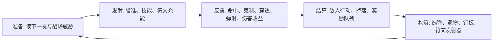

# 核心游玩界面 UI 与沉浸视觉框架

> 本文档从游戏设计视角规划 Echo Alchemist V2 的核心游玩界面，重点覆盖 UI 信息呈现、战斗场地叙事、沉浸感美术资产和后续落地框架。
>
> 相关执行规格继续以 [`design_spec_bitmap.md`](../../design_spec_bitmap.md)、[`docs/ui_asset_requirements.md`](../ui_asset_requirements.md)、[`docs/p0_interaction_optimization_todo.md`](../p0_interaction_optimization_todo.md) 为准。本文负责回答“界面为什么这样组织、玩家应该先看什么、资产应该服务什么体验”。

## 1. 设计定位

Echo Alchemist V2 的核心体验不是单纯的打砖块，也不是传统塔防，而是：

**在一张炼金战台上，用弹药配方、钉板结构、符文词条和局内遗物，把一次发射变成一次可预判、可解释、可成长的炼成实验。**

核心游玩界面必须同时承担三件事：

| 目标 | 玩家问题 | 界面职责 |
|---|---|---|
| 可读 | 我现在危险吗？下一发是什么？打中了发生什么？ | 用最短路径呈现生存压力、行动资源、命中收益和状态变化 |
| 可控 | 我能做什么？为什么现在不能做？ | 让发射、技能、符文充能、选择确认和禁用原因都即时可见 |
| 沉浸 | 我是在一个怎样的战场中炼成？ | 用场地、材质、光效、敌人形体和奖励飞行动画把系统行为视觉化 |

## 2. 总体体验框架

核心循环按“准备、发射、反馈、结算、构筑”五段组织。UI 和美术资产必须围绕这个循环服务，而不是平均分配注意力。

### 2.1 粗到细的信息层级

所有核心界面的信息应分为 4 个阅读层级：

| 层级 | 阅读时机 | 内容 | 呈现原则 |
|---|---|---|---|
| L0 环境态 | 进入界面后 3 秒内 | 当前阶段、回合、场地主题、敌人总体压迫 | 大形状、场地构图、色温、主光源，不依赖文字 |
| L1 决策态 | 行动前 1 秒内 | 防线风险、下一发、剩余弹药、可用技能、关键敌人 | 固定位置、短标签、图标优先、少量数字 |
| L2 解释态 | 事件发生瞬间 | 命中标签、护盾/屏障/克制/暴击、符文充能 | 贴近事件源，短暂显示，不占长期布局 |
| L3 复盘态 | 玩家主动查看 | 伤害统计、图鉴说明、符文词条详情、遗物收益 | 抽屉、侧栏、Tab、图鉴，不挤占主战场 |

### 2.2 三条设计底线

- **战场优先**：敌人、弹丸、发射器和防线永远是第一视觉层。HUD 只能解释战场，不能遮挡战场。
- **短标签优先**：战斗中避免长句说明，使用“护盾 / 克制 / 穿透 / 弹射 / 危险”等短标签；复杂解释放入真理之书或悬停详情。
- **资产服务机制**：每个美术资产都要对应一个玩法信息，例如发射器表达下一发，敌人轮廓表达碰撞体积，背景装置表达阶段气氛。

## 3. 核心游玩空间设定

### 3.1 场地母题

核心战场是一座竖屏炼金战台，由上至下形成自然阅读顺序：

| 区域 | 空间叙事 | 玩法职责 | 视觉关键词 |
|---|---|---|---|
| 上沿 | 敌人从裂隙或炼金门压入战台 | 敌人生成、防线压力预告、Boss 入场 | 裂隙、门框、警戒刻线、远端冷光 |
| 中场 | 主战斗板面 | 弹丸轨迹、敌人碰撞、Peg/障碍、状态覆盖 | 黑曜石板、金属导轨、磨损刻痕、能量回路 |
| 下沿 | 玩家发射与炼成工作台 | 发射器、下一发、弹药队列、技能与符文充能 | 发射炮台、能量舱、配方槽、电容柱、炼金液管 |
| 侧翼 | 构筑与复盘仪表 | PC 侧栏、配方 HUD、符文发射器、伤害统计 | 嵌入式仪表、卡槽、卷轴式面板 |

### 3.2 场地装饰原则

场地装饰分为“可读装饰”和“气氛装饰”：

| 类型 | 可出现位置 | 规则 |
|---|---|---|
| 可读装饰 | 发射器、墙体、防线、敌人足迹、属性球轨道 | 必须稳定、可复用，并直接说明机制状态 |
| 气氛装饰 | 背景纹理、远景炼金阵、低对比暗纹、边缘管线 | 不能和弹丸、敌人状态、伤害数字抢亮度 |

建议将场地背景控制为低对比，中场留出干净的“弹道阅读区”。高亮集中在发射器、敌人核心、命中反馈和奖励飞行动画上。

## 4. 战斗主界面框架

`#phase-combat` 是整个项目的视觉锚点。其他页面的材质、边框、图标和动画都应从战斗主界面延展出去。

### 4.1 战斗界面信息分区

| 分区 | 常驻信息 | 状态信息 | 设计要求 |
|---|---|---|---|
| 顶部状态栏 | 回合、阶段、护盾、生存资源 | 局内商人倒计时、特殊回合提示 | 一行内完成，不扩张高度 |
| 战斗态势条 | 防线风险、敌人数、Boss/精英数、护盾层、弹药余量 | 高压提示、下一波预告 | 作为战前判断入口，语言固定 |
| 中央战场 | 敌人、Peg、弹丸、掉落物 | 状态短标签、命中反馈、受击数字 | 事件贴近源头，避免浮层常驻 |
| 底部发射器 | 下一发属性、伤害、散射、连射、装填格 | 蓄力、瞄准角、属性球轨道 | 发射器必须像一个可工作的机器，而不是按钮 |
| 技能与符文区 | SP、技能成本、可用状态、符文充能 | 禁用原因、升级提示 | 图标按钮 + 小数字，禁用原因在近旁显示 |
| 复盘入口 | 伤害统计、词条说明 | 回合切换、属性贡献 | 默认折叠，玩家主动打开 |

### 4.2 战斗前 1 秒阅读路径

玩家准备发射前，视线应自然经过：

1. 顶部/态势条：确认“防线是否危险”。
2. 敌人阵列：确认“优先目标和特殊状态”。
3. 底部发射器：确认“下一发能做什么”。
4. 技能/符文：确认“是否有主动操作能改变局面”。

任何新增 UI 都必须问一句：它是否帮助这条阅读路径？如果不能，就应进入 L3 复盘层或图鉴层。

### 4.3 战斗中事件反馈语法

| 事件 | 呈现位置 | 推荐表现 | 禁止表现 |
|---|---|---|---|
| 命中 | 敌人附近 | 伤害数字 + 1-2 个语义短标签 | 大段公式说明 |
| 克制/有效 | 伤害数字旁 | 彩色短标、轻微脉冲 | 遮挡敌人本体 |
| 护盾/屏障 | 敌人轮廓或状态行 | 几何膜、六边形网格、短标 | 全身高亮导致轮廓丢失 |
| 穿透/弹射 | 弹道附近 | 细线残影、路径闪烁 | 大面积光爆 |
| 符文充能 | 发射器或符文槽附近 | 能量灌注、槽位点亮 | 远离触发源的 Toast |
| 敌人行动 | 敌人身上 | 前摇、足迹、位移线、状态角标 | 只靠回合文字提示 |

## 5. 关键界面框架

### 5.1 研磨阶段 `#phase-gathering`

研磨阶段是“构筑被验证”的物理空间。界面应强调钉板布局、弹珠路径和收益收集。

| 信息问题 | UI 答案 | 美术答案 |
|---|---|---|
| 我这轮在收集什么？ | 底部弹药队列、配方 HUD、收集进度 | 弹药槽、炼金液管、收集容器 |
| 哪些钉是特殊的？ | 钉板图标、hover/focus 描述、融合摘要 | 异形钉轮廓、槽位材质、符文刻印 |
| 我能否开始采集？ | 开始按钮状态、阻塞原因 | 工作台启动灯、锁定/解锁槽位 |

研磨阶段的装饰应更像“炼金工坊俯视图”，相比战斗阶段可以更温暖、更偏金属与液体，但仍保持中场低对比，避免干扰弹珠轨迹。

### 5.2 弹珠选择 / 命运时刻 `#phase-selection`

选择界面承担构筑决策，必须将普通选择、混沌精华、纯净精华区分清楚。

| 模式 | 第一视觉信号 | 信息重点 | 资产建议 |
|---|---|---|---|
| 普通弹珠选择 | 稳定的炼金卡桌 | 三选需求、已选数量、弹珠属性 | 卡片 9-Slice、属性圆槽、低对比工坊背景 |
| 混沌精华 | 不稳定紫红裂隙 | 替换、随机性、风险收益 | 紫红晶体、扭曲边框、短暂噪声光 |
| 纯净精华 | 蓝白净化核心 | 合法属性、符文注入、同化加成 | 蓝白晶槽、清晰合法/非法状态 |

选择界面不应模拟商店。它更像战斗结束后的“炼成台判定仪式”：奖励从场地飞入卡片、卡片承接构筑选择。

### 5.3 符文发射器 `#phase-rune-launcher`

符文发射器是长期构筑中枢。它的信息架构建议固定为三层：

| Tab | 玩家意图 | 需要看见的信息 |
|---|---|---|
| 配置 | 我当前装了什么？ | 3x3 格、已激活词条、空槽、可替换符文 |
| 管理 | 我有哪些材料？ | 库存、等级、可合成、可重铸、碎片 |
| 图鉴 | 我还能追什么？ | 已发现/未发现词条、材料需求、激活状态 |

视觉上它应像一台可插拔符文的精密仪器，而不是普通背包。九宫格槽位、符文插入反馈、词条激活光路是核心资产。

### 5.4 遗物 / 商店 / 真理之书

这三类页面应共享一套卡片语法，降低玩家学习成本。

| 页面 | 主信息 | 卡片头部统一字段 | 差异化装饰 |
|---|---|---|---|
| 遗物选择 | 获得永久/局内被动 | 名称、稀有度、收益、禁用/跳过 | 仪式光环、奖励飞入 |
| 商店 | 支付资源换成长 | 名称、价格、持有资源、购买状态 | 货架、价格牌、商人印记 |
| 真理之书 | 解释机制与验证入口 | 名称、分类、发现状态、机制摘要 | 书页、章节侧标、样例场景缩略图 |

## 6. 视觉资产系统

### 6.1 资产层级

| 层级 | 资产类型 | 作用 | 当前关联 |
|---|---|---|---|
| 场地背景 | `bg_main_canvas.png`、阶段背景 | 定义空间、色温、沉浸底座 | `docs/ui_asset_requirements.md` §1.6/1.7 |
| 结构件 | 顶栏、底栏、发射器、面板 9-Slice | 固定信息容器 | `assets/ui/panels/`、`assets/ui/sprites/` |
| 机制图标 | 弹药、符文、遗物、技能 | 快速识别系统对象 | `assets/icons/`、`src/bitmap_icons.js` |
| 战场对象 | 敌人、Boss、掉落物、Peg、特殊钉 | 承载物理与机制 | `design_spec_bitmap.md` §3 |
| 反馈特效 | 命中、护盾、温度、奖励飞行、充能 | 解释事件结果 | Canvas 现有逻辑 + 后续轻量 Sprite |
| 装饰边缘 | 角饰、刻线、暗纹、管线 | 增强世界感 | 低对比、低频出现 |

### 6.2 材质与色彩角色

| 角色 | 主材质 | 色彩倾向 | 用途 |
|---|---|---|---|
| 基底 | 黑曜石、深灰磨石、暗金属 | slate / charcoal | 背景、战台、敌人主体 |
| 炼金能量 | 暗金、琥珀、翠绿 | gold / emerald | 可用、激活、收益 |
| 危险压力 | 赤红、熔橙 | red / orange | 防线危险、过热、Boss 压迫 |
| 命运异变 | 紫红、深紫 | violet / magenta | 混沌精华、命运时刻、稀有事件 |
| 净化/控制 | 冰蓝、白蓝 | cyan / ice | 纯净精华、冻结、合法注入 |

避免让界面长期被单一紫色或深蓝统治。每个屏幕允许一个主色温，但关键机制状态必须有稳定的跨界面颜色身份。

### 6.3 敌人与场地关系

敌人统一遵循“几何磨石块基座 + 镶嵌核心”。战场背景和 UI 材质也应呼应这一点：

- 战台表面使用磨损石板、刻线和金属嵌条，像敌人材质的“文明侧版本”。
- 敌人主体比场地更厚、更粗粝、更具碰撞感。
- UI 面板比战场更精密，有 9-Slice 边框、机械槽位和炼金纹理。
- 状态覆层只改写局部，不覆盖敌人 silhouette。

## 7. 信息呈现组件规范

### 7.1 常驻 HUD

| 组件 | 信息密度 | 规则 |
|---|---|---|
| 顶部状态栏 | 低 | 只放运行态公共信息，不放长解释 |
| 战斗态势条 | 中 | 固定字段，稳定排序，避免临时插队 |
| 发射器读数 | 中高 | 图形表达优先，数字只补充伤害/次数 |
| 技能栏 | 中 | 图标、成本、可用态、禁用原因四件套 |
| 符文充能 | 中 | 保留完成/未完成/可领取三态 |

### 7.2 临时反馈

临时反馈应遵循：

- 出现位置贴近事件源。
- 存在时间短，必要时进入历史统计。
- 同屏优先合并，例如敌人状态最多显示 3 个短标签。
- 移动端优先避免底部安全区和技能栏遮挡。

### 7.3 解释型面板

解释型面板用于回答“为什么”。它们可以更密集，但必须分层：

| 面板 | 一级信息 | 二级信息 |
|---|---|---|
| 伤害统计 | 本回合总伤、属性贡献、最高单击 | 每次命中详情 |
| 真理之书 | 机制结论、触发条件 | 数值公式、验证入口 |
| 符文图鉴 | 词条名、材料、是否可激活 | 效果说明、历史发现 |
| 遗物详情 | 收益、稀有度、是否可选 | 叠层、互斥、来源 |

## 8. 落地路线

### 8.1 P0：固定核心战斗阅读路径

目标：不新增大系统，先让玩家稳定读懂战斗。

- 统一战斗态势条字段和文案顺序。
- 检查顶部栏、态势条、技能栏、符文充能、伤害数字在移动端不互相遮挡。
- 发射器继续作为下一发信息中心，确保 HUD 与 Canvas 读数一致。
- 敌人足迹、状态短标签、Boss/精英层级保持优先级稳定。

### 8.2 P1：统一构筑页面信息架构

目标：让选择、符文、遗物、商店使用同一套决策语法。

- 符文发射器完成“配置 / 管理 / 图鉴”的信息闭环。
- 遗物、商店、真理之书统一卡片头部字段。
- 钉板符文融合结果和发射器可用词条建立明确反馈链。
- 选择界面区分普通、混沌、纯净三种视觉状态。

### 8.3 P2：沉浸资产系统化接入

目标：把已有机制读数转化为更强的场地与资产表现。

- 先替换静态装饰层：背景、面板、卡片、发射器、槽位。
- 再接入战场对象：敌人 Sprite、Boss 形象、掉落物实体。
- 最后补事件动画：奖励飞入、符文插入、发射器充能、场地高压警戒。
- 涉及新粒子、混合模式、渐变或敌人绘制时，按性能规范接入 `CONFIG.performance` 三档预算。

## 9. 验收标准

### 9.1 设计验收

| 场景 | 验收问题 |
|---|---|
| 进入战斗 3 秒 | 玩家是否知道当前阶段、敌人压力、下一发用途？ |
| 发射前 | 玩家是否能不用打开说明就判断该打哪里？ |
| 命中后 | 玩家是否知道本次命中为何高/低收益？ |
| 回合结束 | 玩家是否看得见奖励来源和下一步去向？ |
| 构筑页面 | 玩家是否知道当前选择会影响哪个系统？ |

### 9.2 视觉验收

- 战场中场保持低对比，弹丸和敌人状态不被背景淹没。
- 发射器、敌人、奖励掉落物有明确材质差异。
- `high / medium / low` 三档下，身份线索不依赖昂贵光效。
- 移动端安全区内没有关键按钮或确认区被遮挡。
- PC 三栏布局下，侧栏信息不与主战场竞争第一视线。

### 9.3 文档与资产验收

- 新增 UI 素材时，同步更新 `docs/ui_asset_requirements.md`。
- 新增或调整位图规格时，同步更新 `design_spec_bitmap.md`。
- 新增敌人/Boss 资产时，遵循 `docs/design/enemy_geometric_whetstone_style.md` 和资产 manifest。
- 修改代码中的高开销渲染效果时，补性能影响评估。

## 10. 后续可拆任务

| 任务 | 产出 | 优先级 |
|---|---|---|
| 战斗主界面信息草图 | `#phase-combat` 信息分区图、移动端/PC 两版 | P0 |
| 发射器读数视觉规范 | 下一发、散射、连射、属性球轨道状态表 | P0 |
| 选择界面三模式视觉规范 | 普通/混沌/纯净的卡片、背景、按钮状态 | P1 |
| 符文发射器 IA 细化 | 三 Tab 信息层级、图鉴状态、融合反馈链 | P1 |
| 场地背景分层规范 | 上沿/中场/下沿/侧翼的可读装饰清单 | P2 |
| 奖励飞入动效方案 | 掉落物实体、飞行路径、性能三档 | P2 |

## 11. 当前结论

核心游玩界面的下一阶段不应先追求“更多装饰”，而应先固定一套稳定的阅读秩序：

**战场告诉玩家压力，发射器告诉玩家行动，命中反馈告诉玩家原因，奖励动画告诉玩家成长，构筑页面告诉玩家下一轮会怎样变强。**

只要这条链路稳定，后续 UI 位图化、敌人 Sprite、Boss 形象和场地装饰都会有明确的服务对象，不会变成彼此争夺注意力的孤立美术资源。
