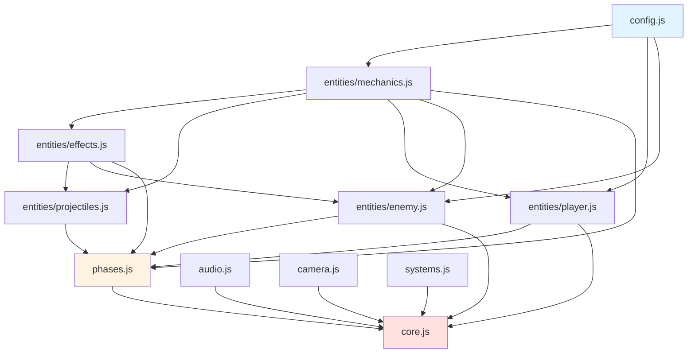

# Echo Alchemist 代码重构方案（平衡版）

**版本**: v2.0 平衡版  
**日期**: 2026-01-03  
**状态**: 待审批

---

## 一、方案概述

本方案在**激进拆分**和**保守拆分**之间取得平衡，目标是：
- ✅ 单文件行数控制在 **1000-2000行**（最大不超过2500行）
- ✅ 总文件数控制在 **10-12个**（不含render3d，render3d保持不变）
- ✅ 每个文件有明确的职责边界
- ✅ 最小化导入依赖复杂度
- ✅ 提供完整的验收表和验收SOP

---

## 二、平衡版拆分方案

### 2.1 目标文件结构

```
src/
├── core.js                    # 游戏主入口 (800-1000行)
│   └── class Game (核心协调逻辑)
│
├── audio.js                   # 音频系统 (900行)
│   └── class SoundManager
│
├── phases.js                  # 所有阶段逻辑 (1800-2000行)
│   ├── class SelectionPhase
│   ├── class GatheringPhase
│   └── class CombatPhase
│
├── entities/
│   ├── player.js             # 玩家类 (700行)
│   ├── enemy.js              # 敌人类 (1300行)
│   ├── mechanics.js          # 游戏机制实体 (1900行)
│   │   ├── Vec2, MarbleDefinition, SpecialSlot
│   │   ├── FortuneWheel, Peg, DropBall
│   ├── projectiles.js        # 投射物 (1450行)
│   │   ├── Projectile, SwordQi, SonSword, SlashAnim
│   │   ├── LaserBeam, LightningBolt, FireWave
│   └── effects.js            # 粒子效果 (650行)
│       ├── Particle, SlashEffect, CollectionBeam
│       ├── Shockwave, FloatingText, EnergyOrb, CloneSpore
│
├── systems.js                 # UI和系统 (1488行，保持不变)
│   ├── class UIManager
│   ├── class TrainingGround
│   └── class TruthBook
│
├── camera.js                  # 相机系统 (161行，保持不变)
└── config.js                  # 配置数据 (683行，保持不变)

render3d/                      # 3D渲染系统（不动）
```

### 2.2 文件统计

| 文件 | 当前行数 | 重构后行数 | 变化 | 说明 |
|------|---------|-----------|------|------|
| `core.js` | 8393 | 900 | -89% | 仅保留Game类核心协调逻辑 |
| `audio.js` | - | 900 | 新增 | 从core.js分离SoundManager |
| `phases.js` | - | 1900 | 新增 | 三个阶段类合并在一个文件 |
| `entities/player.js` | - | 700 | 新增 | 从entities.js分离 |
| `entities/enemy.js` | - | 1300 | 新增 | 从entities.js分离 |
| `entities/mechanics.js` | - | 1900 | 新增 | 游戏机制相关实体 |
| `entities/projectiles.js` | - | 1450 | 新增 | 所有投射物和技能 |
| `entities/effects.js` | - | 650 | 新增 | 所有粒子效果 |
| `systems.js` | 1488 | 1488 | 0% | 保持不变 |
| `camera.js` | 161 | 161 | 0% | 保持不变 |
| `config.js` | 683 | 683 | 0% | 保持不变 |

**总文件数**: 11个（不含render3d）

---

## 三、详细拆分映射

### 3.1 core.js 拆分（8393行 → 3个文件）

#### 文件1: audio.js (900行)

**来源**: core.js 第70-948行

| 类/方法 | 行数范围 | 说明 |
|---------|---------|------|
| `class SoundManager` | 70-948 | 完整的音频引擎 |
| └─ constructor | 74-99 | 初始化Web Audio API |
| └─ createNoiseBuffer | 100-108 | 创建噪音缓冲 |
| └─ createRollingSound | 109-162 | 创建滚动音效 |
| └─ toggleMute | 167-178 | 切换静音 |
| └─ resume | 183 | 恢复音频上下文 |
| └─ playEffect | 188-374 | 播放特效音（burn_tick, freeze, regen等） |
| └─ playSlash | 375-423 | 播放斩击音 |
| └─ playMagic | 424-440 | 播放魔法音 |
| └─ playTone | 441-479 | 播放音调 |
| └─ playHit | 480-591 | 播放击中音 |
| └─ playShoot | 592-642 | 播放射击音 |
| └─ playExplosion | 643-647 | 播放爆炸音 |
| └─ playLightning | 648-696 | 播放闪电音 |
| └─ playEnemyHit | 697-881 | 播放敌人受击音 |
| └─ playPowerup | 882-943 | 播放强化音 |
| └─ playCollect | 944-948 | 播放收集音 |

#### 文件2: phases.js (1900行)

**来源**: core.js 中的阶段相关方法

**设计**: 三个阶段类合并在一个文件中，便于理解阶段切换逻辑

```javascript
// phases.js 结构
class PhaseBase { /* 基类 */ }

class SelectionPhase extends PhaseBase {
    // 来源方法:
    // - sys_initSelectionPhase (5355行)
    // - sys_toggleMarbleSelection (5447行)
    // - spawn_generateMarbleOptions (5373行)
    // - ui_confirmSelection (5467行)
}

class GatheringPhase extends PhaseBase {
    // 来源方法:
    // - phase_startGatheringPhase (5481行)
    // - phase_gathering_initPachinko (5733行)
    // - phase_gathering_getRandomPegType (5837行)
    // - phase_gathering_update (8084行)
    // - phase_gathering_attemptComplete (7879行)
    // - sys_initRecipeHUD (5515行)
    // - sys_toggleHud (5524行)
    // - ui_renderRecipeHUD (5536行)
    // - ui_renderRecipeCard (5634行)
    // - ui_updateGatheringQueueUI (7026行)
}

class CombatPhase extends PhaseBase {
    // 来源方法: 所有 combat_* 方法（32个）
    // - combat_damageEnemy (4222行)
    // - combat_updateLogic (7380行)
    // - combat_render2D (7663行)
    // - combat_wind_* 系列方法
    // - combat_lightning_* 系列方法
    // - combat_laser_* 系列方法
    // - spawn_spawnEnemyRowAt (2658行)
    // - spawn_spawnBullet (6367行)
    // - spawn_createExplosion (6782行)
    // - spawn_createShockwave (6794行)
    // - spawn_createHitFeedback (6827行)
    // - calc_compileCollectionToRecipe (6963行)
    // - ui_updateAmmoUI (7068行)
    // - ui_renderAmmoIcon (7114行)
    // - phase_enemy_processTurn (7167行)
    // - phase_enemy_startLogic (7231行)
    // - phase_finalizeRound (7261行)
    // - phase_combat_update (7368行)
    // - render_combat_launcherOrbitals (7938行)
}
```

**方法映射表**:

| 原Game类方法 | 目标类 | 新方法名 | 行数 |
|-------------|--------|---------|------|
| sys_initSelectionPhase | SelectionPhase | init() | ~100 |
| sys_toggleMarbleSelection | SelectionPhase | toggleMarbleSelection() | ~20 |
| spawn_generateMarbleOptions | SelectionPhase | generateMarbleOptions() | ~74 |
| ui_confirmSelection | SelectionPhase | confirmSelection() | ~14 |
| phase_startGatheringPhase | GatheringPhase | init() | ~34 |
| phase_gathering_initPachinko | GatheringPhase | initPachinko() | ~104 |
| phase_gathering_update | GatheringPhase | update() | ~278 |
| phase_gathering_attemptComplete | GatheringPhase | attemptComplete() | ~59 |
| phase_startCombatPhase | CombatPhase | init() | ~37 |
| combat_updateLogic | CombatPhase | updateLogic() | ~283 |
| combat_render2D | CombatPhase | render2D() | ~216 |
| combat_damageEnemy | CombatPhase | damageEnemy() | ~416 |
| ... (其他combat_*方法) | CombatPhase | 保持原名 | - |

#### 文件3: core.js (重构后，900行)

**保留内容**: Game类的核心协调逻辑

| 方法类别 | 方法列表 | 说明 |
|---------|---------|------|
| **核心生命周期** | constructor, initGame, initStats | 初始化 |
| **主循环** | sys_loop | 游戏主循环 |
| **阶段切换** | phase_switchPhase | 阶段切换协调 |
| **渲染协调** | render_clearCanvas, render_background, render_floatingTexts, render_windAnchors, render_singleWindMatrix, render_butterflyPathWave | 2D渲染协调 |
| **输入处理** | sys_setupInputs, input_handleOrientation, input_getTiltOffset, input_checkEnemyHover, input_handleInputEnd, input_handleInputMove, input_checkDefeat | 输入事件 |
| **系统功能** | sys_resize, sys_resetGame, sys_loadSaveData, sys_saveData, toggle3DMode | 系统级功能 |
| **UI协调** | ui_playResourceFlyEffect, ui_openTruthBook, ui_closeTruthBook, ui_updateSlowMotion, ui_updateMetaCurrency | UI协调 |
| **元游戏** | meta_applyUpgrades, meta_addCurrency, meta_startRun, meta_openShop, meta_calculateUpgradeCost, meta_buyUpgrade | 元游戏系统 |
| **工具方法** | triggerScreenShake, checkLineIntersection, isBowtieShape, getLineIntersectionPoint, calc_isAreaOccupied, calc_calculateWaveSpeed, calc_getPeakAverageDamage, calc_evaluateAndAdjustDifficulty, calc_calculateDynamicThreshold | 通用工具 |
| **相机** | camera_enableDistantView, camera_disableDistantView | 相机控制 |

**移除内容**:
- ❌ SoundManager类（移至audio.js）
- ❌ 所有阶段特定逻辑（移至phases.js）
- ❌ 所有combat_*方法（移至phases.js的CombatPhase）

---

### 3.2 entities.js 拆分（6073行 → 5个文件）

#### 文件1: entities/player.js (700行)

**来源**: entities.js 第5379-6073行

| 类/方法 | 说明 |
|---------|------|
| `class Player` | 玩家类 |
| └─ constructor | 初始化玩家 |
| └─ getPosition | 获取位置 |
| └─ updatePosition | 更新位置 |
| └─ update | 更新逻辑 |
| └─ updateCharging | 更新蓄力 |
| └─ updateShield | 更新护盾 |
| └─ updateOrbitals | 更新轨道物 |
| └─ updateDash | 更新冲刺 |
| └─ takeDamage | 受到伤害 |
| └─ heal | 治疗 |
| └─ addShield | 添加护盾 |
| └─ addMaxHP | 增加最大生命 |
| └─ gainExp | 获得经验 |
| └─ levelUp | 升级 |
| └─ addRelic | 添加遗物 |
| └─ hasRelic | 检查遗物 |
| └─ getRelicCount | 获取遗物数量 |
| └─ applyRelic | 应用遗物效果 |
| └─ draw | 绘制玩家 |
| └─ drawOrbitals | 绘制轨道物 |
| └─ drawShield | 绘制护盾 |
| └─ drawHealthBar | 绘制血条 |
| └─ drawExpBar | 绘制经验条 |

#### 文件2: entities/enemy.js (1300行)

**来源**: entities.js 第1966-3278行

| 类/方法 | 说明 |
|---------|------|
| `class Enemy` | 敌人类 |
| └─ constructor | 初始化敌人 |
| └─ update | 更新逻辑 |
| └─ addSwordCrack | 添加剑痕 |
| └─ updateTempParticles | 更新临时粒子 |
| └─ advance | 前进 |
| └─ takeDamage | 受到伤害 |
| └─ applyBurn | 应用燃烧 |
| └─ applyFreeze | 应用冰冻 |
| └─ processBurn | 处理燃烧 |
| └─ processFreeze | 处理冰冻 |
| └─ processRegen | 处理再生 |
| └─ die | 死亡 |
| └─ draw | 绘制敌人 |
| └─ drawHealthBar | 绘制血条 |
| └─ drawAffixIcons | 绘制词缀图标 |
| └─ drawStatusEffects | 绘制状态效果 |
| └─ drawSwordCracks | 绘制剑痕 |
| └─ drawTempParticles | 绘制临时粒子 |

#### 文件3: entities/mechanics.js (1900行)

**来源**: entities.js 中的游戏机制类

| 类 | 行数范围 | 方法数 | 说明 |
|----|---------|--------|------|
| `Vec2` | 111-163 | 11 | 2D向量类 |
| `MarbleDefinition` | 164-193 | 3 | 弹珠定义 |
| `SpecialSlot` | 194-232 | 2 | 特殊槽位 |
| `FortuneWheel` | 233-522 | 6 | 命运轮盘 |
| `Peg` | 523-990 | 13 | 弹珠机钉子 |
| `DropBall` | 991-1965 | 0 | 弹珠球（主要是update逻辑） |

**独立函数**:
- `getAudio()` (第27行)
- `adjustColorBrightness()` (第43行)
- `lerpColor()` (第79行)
- `lerp()` (第93行)
- `hexToRgba()` (第97行)
- `showToast()` (第156行)

#### 文件4: entities/projectiles.js (1450行)

**来源**: entities.js 中的投射物类

| 类 | 行数范围 | 方法数 | 说明 |
|----|---------|--------|------|
| `Projectile` | 3839-4557 | 9 | 基础投射物 |
| `SwordQi` | 3279-3334 | 3 | 剑气 |
| `SlashAnim` | 3335-3387 | 6 | 斩击动画 |
| `SonSword` | 3388-3838 | 7 | 子剑 |
| `LaserBeam` | 5010-5063 | 3 | 激光束 |
| `LightningBolt` | 5239-5332 | 4 | 闪电 |
| `FireWave` | 5333-5378 | 3 | 火焰波 |

**独立函数**:
- `rotateTowards()` (第3373行)

#### 文件5: entities/effects.js (650行)

**来源**: entities.js 中的粒子效果类

| 类 | 行数范围 | 方法数 | 说明 |
|----|---------|--------|------|
| `Particle` | 4617-4829 | 3 | 基础粒子 |
| `SlashEffect` | 4830-4904 | 3 | 斩击效果 |
| `CollectionBeam` | 4905-4958 | 3 | 收集光束 |
| `Shockwave` | 4959-5009 | 3 | 冲击波 |
| `FloatingText` | 5064-5106 | 3 | 浮动文字 |
| `EnergyOrb` | 5107-5238 | 3 | 能量球 |
| `CloneSpore` | 4558-4616 | 3 | 分身孢子 |

---

## 四、验收表

### 4.1 类验收表

#### core.js 类验收表

| 原文件 | 类名 | 行数范围 | 目标文件 | 状态 | 验收人 | 验收日期 |
|--------|------|---------|---------|------|--------|---------|
| core.js | SoundManager | 70-948 | audio.js | ⬜ 待迁移 | | |
| core.js | Game | 951-8382 | core.js (重构) + phases.js | ⬜ 待拆分 | | |

#### entities.js 类验收表

| 原文件 | 类名 | 行数范围 | 目标文件 | 状态 | 验收人 | 验收日期 |
|--------|------|---------|---------|------|--------|---------|
| entities.js | Vec2 | 111-163 | entities/mechanics.js | ⬜ 待迁移 | | |
| entities.js | MarbleDefinition | 164-193 | entities/mechanics.js | ⬜ 待迁移 | | |
| entities.js | SpecialSlot | 194-232 | entities/mechanics.js | ⬜ 待迁移 | | |
| entities.js | FortuneWheel | 233-522 | entities/mechanics.js | ⬜ 待迁移 | | |
| entities.js | Peg | 523-990 | entities/mechanics.js | ⬜ 待迁移 | | |
| entities.js | DropBall | 991-1965 | entities/mechanics.js | ⬜ 待迁移 | | |
| entities.js | Enemy | 1966-3278 | entities/enemy.js | ⬜ 待迁移 | | |
| entities.js | SwordQi | 3279-3334 | entities/projectiles.js | ⬜ 待迁移 | | |
| entities.js | SlashAnim | 3335-3387 | entities/projectiles.js | ⬜ 待迁移 | | |
| entities.js | SonSword | 3388-3838 | entities/projectiles.js | ⬜ 待迁移 | | |
| entities.js | Projectile | 3839-4557 | entities/projectiles.js | ⬜ 待迁移 | | |
| entities.js | CloneSpore | 4558-4616 | entities/effects.js | ⬜ 待迁移 | | |
| entities.js | Particle | 4617-4829 | entities/effects.js | ⬜ 待迁移 | | |
| entities.js | SlashEffect | 4830-4904 | entities/effects.js | ⬜ 待迁移 | | |
| entities.js | CollectionBeam | 4905-4958 | entities/effects.js | ⬜ 待迁移 | | |
| entities.js | Shockwave | 4959-5009 | entities/effects.js | ⬜ 待迁移 | | |
| entities.js | LaserBeam | 5010-5063 | entities/projectiles.js | ⬜ 待迁移 | | |
| entities.js | FloatingText | 5064-5106 | entities/effects.js | ⬜ 待迁移 | | |
| entities.js | EnergyOrb | 5107-5238 | entities/effects.js | ⬜ 待迁移 | | |
| entities.js | LightningBolt | 5239-5332 | entities/projectiles.js | ⬜ 待迁移 | | |
| entities.js | FireWave | 5333-5378 | entities/projectiles.js | ⬜ 待迁移 | | |
| entities.js | Player | 5379-6073 | entities/player.js | ⬜ 待迁移 | | |

### 4.2 Game类方法验收表

#### 保留在core.js的方法（约60个）

| 方法名 | 原行号 | 分类 | 状态 | 备注 |
|--------|--------|------|------|------|
| constructor | 997 | 核心 | ⬜ 待验收 | |
| initGame | 1081 | 核心 | ⬜ 待验收 | |
| initStats | 1028 | 核心 | ⬜ 待验收 | |
| sys_loop | 1460 | 主循环 | ⬜ 待验收 | |
| sys_resize | 2002 | 系统 | ⬜ 待验收 | |
| sys_initGameStart | 2040 | 系统 | ⬜ 待验收 | |
| sys_loadSaveData | 2084 | 系统 | ⬜ 待验收 | |
| sys_saveData | 2102 | 系统 | ⬜ 待验收 | |
| sys_resetGame | 2255 | 系统 | ⬜ 待验收 | |
| sys_setupInputs | 2295 | 输入 | ⬜ 待验收 | |
| toggle3DMode | 2379 | 系统 | ⬜ 待验收 | |
| input_handleOrientation | 2409 | 输入 | ⬜ 待验收 | |
| render_clearCanvas | 1572 | 渲染 | ⬜ 待验收 | |
| render_background | 1583 | 渲染 | ⬜ 待验收 | |
| render_windAnchors | 1604 | 渲染 | ⬜ 待验收 | |
| render_butterflyPathWave | 1804 | 渲染 | ⬜ 待验收 | |
| render_singleWindMatrix | 1830 | 渲染 | ⬜ 待验收 | |
| render_floatingTexts | 1988 | 渲染 | ⬜ 待验收 | |
| meta_applyUpgrades | 2057 | 元游戏 | ⬜ 待验收 | |
| meta_addCurrency | 2109 | 元游戏 | ⬜ 待验收 | |
| meta_startRun | 2128 | 元游戏 | ⬜ 待验收 | |
| meta_openShop | 2137 | 元游戏 | ⬜ 待验收 | |
| meta_calculateUpgradeCost | 2218 | 元游戏 | ⬜ 待验收 | |
| meta_buyUpgrade | 2229 | 元游戏 | ⬜ 待验收 | |
| ui_playResourceFlyEffect | 953 | UI | ⬜ 待验收 | |
| ui_openTruthBook | 1222 | UI | ⬜ 待验收 | |
| ui_closeTruthBook | 1230 | UI | ⬜ 待验收 | |
| ui_updateSlowMotion | 1410 | UI | ⬜ 待验收 | |
| ui_updateMetaCurrency | 2118 | UI | ⬜ 待验收 | |
| ui_renderShop | 2146 | UI | ⬜ 待验收 | |
| triggerScreenShake | 3097 | 工具 | ⬜ 待验收 | |
| checkLineIntersection | 3104 | 工具 | ⬜ 待验收 | |
| isBowtieShape | 3122 | 工具 | ⬜ 待验收 | |
| getLineIntersectionPoint | 3741 | 工具 | ⬜ 待验收 | |
| calc_getPeakAverageDamage | 1244 | 计算 | ⬜ 待验收 | |
| calc_evaluateAndAdjustDifficulty | 1316 | 计算 | ⬜ 待验收 | |
| calc_calculateDynamicThreshold | 1364 | 计算 | ⬜ 待验收 | |
| calc_isAreaOccupied | 2617 | 计算 | ⬜ 待验收 | |
| calc_calculateWaveSpeed | 5108 | 计算 | ⬜ 待验收 | |
| phase_switchPhase | 5169 | 阶段 | ⬜ 待验收 | 核心阶段切换 |
| input_getTiltOffset | 5959 | 输入 | ⬜ 待验收 | |
| input_checkEnemyHover | 6048 | 输入 | ⬜ 待验收 | |
| input_handleInputEnd | 6089 | 输入 | ⬜ 待验收 | |
| input_handleInputMove | 6147 | 输入 | ⬜ 待验收 | |
| input_checkDefeat | 7349 | 输入 | ⬜ 待验收 | |
| camera_enableDistantView | 8362 | 相机 | ⬜ 待验收 | |
| camera_disableDistantView | 8371 | 相机 | ⬜ 待验收 | |

#### 迁移到phases.js的方法（约83个）

**SelectionPhase (4个方法)**

| 方法名 | 原行号 | 新方法名 | 状态 | 备注 |
|--------|--------|---------|------|------|
| sys_initSelectionPhase | 5355 | init() | ⬜ 待迁移 | |
| sys_toggleMarbleSelection | 5447 | toggleMarbleSelection() | ⬜ 待迁移 | |
| spawn_generateMarbleOptions | 5373 | generateMarbleOptions() | ⬜ 待迁移 | |
| ui_confirmSelection | 5467 | confirmSelection() | ⬜ 待迁移 | |

**GatheringPhase (9个方法)**

| 方法名 | 原行号 | 新方法名 | 状态 | 备注 |
|--------|--------|---------|------|------|
| phase_startGatheringPhase | 5481 | init() | ⬜ 待迁移 | |
| phase_gathering_initPachinko | 5733 | initPachinko() | ⬜ 待迁移 | |
| phase_gathering_getRandomPegType | 5837 | getRandomPegType() | ⬜ 待迁移 | |
| phase_gathering_update | 8084 | update() | ⬜ 待迁移 | |
| phase_gathering_attemptComplete | 7879 | attemptComplete() | ⬜ 待迁移 | |
| sys_initRecipeHUD | 5515 | initRecipeHUD() | ⬜ 待迁移 | |
| sys_toggleHud | 5524 | toggleHud() | ⬜ 待迁移 | |
| ui_renderRecipeHUD | 5536 | renderRecipeHUD() | ⬜ 待迁移 | |
| ui_renderRecipeCard | 5634 | renderRecipeCard() | ⬜ 待迁移 | |
| ui_updateGatheringQueueUI | 7026 | updateGatheringQueueUI() | ⬜ 待迁移 | |

**CombatPhase (约70个方法)**

| 方法名 | 原行号 | 新方法名 | 状态 | 备注 |
|--------|--------|---------|------|------|
| phase_startCombatPhase | 5878 | init() | ⬜ 待迁移 | |
| combat_calculatePlayerExpectedDamage | 1267 | calculatePlayerExpectedDamage() | ⬜ 待迁移 | |
| combat_reportDamage | 1357 | reportDamage() | ⬜ 待迁移 | |
| combat_createFloatingText | 2448 | createFloatingText() | ⬜ 待迁移 | |
| combat_updateMulticastDisplay | 2456 | updateMulticastDisplay() | ⬜ 待迁移 | |
| combat_playMulticastTransferEffect | 2489 | playMulticastTransferEffect() | ⬜ 待迁移 | |
| spawn_generateAffixes | 2550 | generateAffixes() | ⬜ 待迁移 | |
| spawn_spawnEnemyRowAt | 2658 | spawnEnemyRowAt() | ⬜ 待迁移 | |
| spawn_addSkillPoint | 2872 | addSkillPoint() | ⬜ 待迁移 | |
| combat_activateSkill | 2884 | activateSkill() | ⬜ 待迁移 | |
| spawn_spawnEnemyRow | 3004 | spawnEnemyRow() | ⬜ 待迁移 | |
| spawn_triggerCloneSpawn | 3010 | triggerCloneSpawn() | ⬜ 待迁移 | |
| combat_flyingSword_assignTarget | 3042 | flyingSword_assignTarget() | ⬜ 待迁移 | |
| combat_flyingSword_addSon | 3061 | flyingSword_addSon() | ⬜ 待迁移 | |
| combat_wind_addAnchor | 3135 | wind_addAnchor() | ⬜ 待迁移 | |
| spawn_smallWhirlwind | 3153 | spawnSmallWhirlwind() | ⬜ 待迁移 | |
| combat_wind_triggerSmallWhirlwindDamage | 3187 | wind_triggerSmallWhirlwindDamage() | ⬜ 待迁移 | |
| combat_wind_executeCircleEffect | 3317 | wind_executeCircleEffect() | ⬜ 待迁移 | |
| combat_wind_spawnStormCore | 3678 | wind_spawnStormCore() | ⬜ 待迁移 | |
| spawn_stormCore | 3998 | spawnStormCore() | ⬜ 待迁移 | |
| combat_damageEnemy | 4222 | damageEnemy() | ⬜ 待迁移 | **最大方法416行** |
| phase_advanceWave | 4638 | advanceWave() | ⬜ 待迁移 | |
| spawn_addScore | 4697 | addScore() | ⬜ 待迁移 | |
| sys_resetMultiplier | 4718 | resetMultiplier() | ⬜ 待迁移 | |
| ui_updateMultiplierUI | 4728 | updateMultiplierUI() | ⬜ 待迁移 | |
| ui_saveShotDamage | 4743 | saveShotDamage() | ⬜ 待迁移 | |
| ui_updateRoundDamage | 4762 | updateRoundDamage() | ⬜ 待迁移 | |
| ui_updateDamageStats | 4810 | updateDamageStats() | ⬜ 待迁移 | |
| ui_toggleDamagePanel | 5003 | toggleDamagePanel() | ⬜ 待迁移 | |
| ui_showRelicSelection | 5195 | showRelicSelection() | ⬜ 待迁移 | |
| ui_selectRelic | 5277 | selectRelic() | ⬜ 待迁移 | |
| ui_closeRelicSelection | 5334 | closeRelicSelection() | ⬜ 待迁移 | |
| data_clearProjectiles | 5915 | clearProjectiles() | ⬜ 待迁移 | |
| spawn_createParticle | 5936 | createParticle() | ⬜ 待迁移 | |
| combat_lightning_triggerChain | 6196 | lightning_triggerChain() | ⬜ 待迁移 | |
| combat_fireNextShot | 6297 | fireNextShot() | ⬜ 待迁移 | |
| spawn_spawnBullet | 6367 | spawnBullet() | ⬜ 待迁移 | |
| combat_laser_fire | 6507 | laser_fire() | ⬜ 待迁移 | |
| combat_laser_castRay | 6626 | laser_castRay() | ⬜ 待迁移 | |
| combat_laser_processPenetration | 6697 | laser_processPenetration() | ⬜ 待迁移 | |
| calc_getLineRectIntersection | 6750 | getLineRectIntersection() | ⬜ 待迁移 | |
| spawn_createExplosion | 6782 | createExplosion() | ⬜ 待迁移 | |
| spawn_createShockwave | 6794 | createShockwave() | ⬜ 待迁移 | |
| ui_updateUICache | 6801 | updateUICache() | ⬜ 待迁移 | |
| spawn_createHitFeedback | 6827 | createHitFeedback() | ⬜ 待迁移 | |
| spawn_triggerLevelUpEvent | 6925 | triggerLevelUpEvent() | ⬜ 待迁移 | |
| calc_compileCollectionToRecipe | 6963 | compileCollectionToRecipe() | ⬜ 待迁移 | |
| combat_updateHitProgress | 7044 | updateHitProgress() | ⬜ 待迁移 | |
| ui_updateAmmoUI | 7068 | updateAmmoUI() | ⬜ 待迁移 | |
| ui_renderAmmoIcon | 7114 | renderAmmoIcon() | ⬜ 待迁移 | |
| phase_enemy_processTurn | 7167 | enemy_processTurn() | ⬜ 待迁移 | |
| phase_enemy_startLogic | 7231 | enemy_startLogic() | ⬜ 待迁移 | |
| phase_finalizeRound | 7261 | finalizeRound() | ⬜ 待迁移 | |
| phase_combat_update | 7368 | update() | ⬜ 待迁移 | |
| combat_updateLogic | 7380 | updateLogic() | ⬜ 待迁移 | |
| combat_render2D | 7663 | render2D() | ⬜ 待迁移 | |
| render_combat_launcherOrbitals | 7938 | renderLauncherOrbitals() | ⬜ 待迁移 | |

### 4.3 独立函数验收表

| 原文件 | 函数名 | 原行号 | 目标文件 | 状态 | 备注 |
|--------|--------|--------|---------|------|------|
| entities.js | getAudio | 27 | entities/mechanics.js | ⬜ 待迁移 | |
| entities.js | adjustColorBrightness | 43 | entities/mechanics.js | ⬜ 待迁移 | |
| entities.js | lerpColor | 79 | entities/mechanics.js | ⬜ 待迁移 | |
| entities.js | lerp | 93 | entities/mechanics.js | ⬜ 待迁移 | |
| entities.js | hexToRgba | 97 | entities/mechanics.js | ⬜ 待迁移 | |
| entities.js | showToast | 156 | entities/mechanics.js | ⬜ 待迁移 | |
| entities.js | rotateTowards | 3373 | entities/projectiles.js | ⬜ 待迁移 | |

---

## 五、验收SOP（标准操作流程）

### 5.1 验收前准备

#### 步骤1: 备份原始文件
```bash
cd src/
cp core.js core.js.backup_$(date +%Y%m%d)
cp entities.js entities.js.backup_$(date +%Y%m%d)
```

#### 步骤2: 创建验收分支
```bash
git checkout -b refactor/balanced-split
```

#### 步骤3: 生成完整清单
```bash
# 使用提供的Python脚本生成JSON清单
python3 generate_inventory.py
```

### 5.2 迁移验收流程

#### 阶段1: 音频系统迁移（预计2小时）

**迁移步骤**:
1. 创建 `src/audio.js`
2. 从 `core.js` 复制 SoundManager 类（第70-948行）
3. 在 `audio.js` 中添加导出: `export { SoundManager };`
4. 在 `core.js` 中删除 SoundManager 类
5. 在 `core.js` 顶部添加导入: `import { SoundManager } from './audio.js';`

**验收检查清单**:
- [ ] `audio.js` 文件已创建
- [ ] `audio.js` 包含完整的 SoundManager 类（15个方法）
- [ ] `audio.js` 正确导出 SoundManager
- [ ] `core.js` 中 SoundManager 类已删除
- [ ] `core.js` 正确导入 SoundManager
- [ ] 游戏启动无报错
- [ ] 音效功能正常（测试至少5种音效）
- [ ] 静音切换功能正常

**验收命令**:
```bash
# 检查语法错误
node --check src/audio.js
node --check src/core.js

# 启动游戏测试
# 在浏览器中打开 index.html
# 测试音效: 射击、爆炸、收集、斩击、魔法
```

**验收签字**:
- 迁移完成: __________ (签名/日期)
- 功能验证: __________ (签名/日期)

---

#### 阶段2: entities.js 拆分（预计6-8小时）

**迁移顺序**: 按依赖关系从底层到顶层

##### 2.1 迁移 entities/mechanics.js

**迁移步骤**:
1. 创建 `src/entities/` 目录
2. 创建 `src/entities/mechanics.js`
3. 从 `entities.js` 复制以下内容:
   - 独立函数: getAudio, adjustColorBrightness, lerpColor, lerp, hexToRgba, showToast
   - Vec2 类（第111-163行）
   - MarbleDefinition 类（第164-193行）
   - SpecialSlot 类（第194-232行）
   - FortuneWheel 类（第233-522行）
   - Peg 类（第523-990行）
   - DropBall 类（第991-1965行）
4. 添加导入: `import { CONFIG } from '../config.js';`
5. 添加导出: `export { Vec2, MarbleDefinition, SpecialSlot, FortuneWheel, Peg, DropBall, getAudio, adjustColorBrightness, lerpColor, lerp, hexToRgba, showToast };`

**验收检查清单**:
- [ ] `entities/mechanics.js` 文件已创建
- [ ] 包含6个类: Vec2, MarbleDefinition, SpecialSlot, FortuneWheel, Peg, DropBall
- [ ] 包含7个独立函数
- [ ] 正确导入 CONFIG
- [ ] 正确导出所有类和函数
- [ ] 文件行数约1900行
- [ ] 语法检查通过

**验收命令**:
```bash
node --check src/entities/mechanics.js
grep -c "^class" src/entities/mechanics.js  # 应输出: 6
grep -c "^function\|^const.*=.*=>" src/entities/mechanics.js  # 应输出: 7
wc -l src/entities/mechanics.js  # 应约为1900行
```

##### 2.2 迁移 entities/effects.js

**迁移步骤**:
1. 创建 `src/entities/effects.js`
2. 从 `entities.js` 复制以下类:
   - Particle (4617-4829)
   - SlashEffect (4830-4904)
   - CollectionBeam (4905-4958)
   - Shockwave (4959-5009)
   - FloatingText (5064-5106)
   - EnergyOrb (5107-5238)
   - CloneSpore (4558-4616)
3. 添加导入: `import { CONFIG } from '../config.js';`
4. 添加导入: `import { Vec2, lerpColor, lerp } from './mechanics.js';`
5. 添加导出: `export { Particle, SlashEffect, CollectionBeam, Shockwave, FloatingText, EnergyOrb, CloneSpore };`

**验收检查清单**:
- [ ] `entities/effects.js` 文件已创建
- [ ] 包含7个类
- [ ] 正确导入依赖
- [ ] 正确导出所有类
- [ ] 文件行数约650行
- [ ] 语法检查通过

##### 2.3 迁移 entities/projectiles.js

**迁移步骤**:
1. 创建 `src/entities/projectiles.js`
2. 从 `entities.js` 复制以下内容:
   - rotateTowards 函数（第3373行）
   - SwordQi 类（3279-3334）
   - SlashAnim 类（3335-3387）
   - SonSword 类（3388-3838）
   - Projectile 类（3839-4557）
   - LaserBeam 类（5010-5063）
   - LightningBolt 类（5239-5332）
   - FireWave 类（5333-5378）
3. 添加导入
4. 添加导出

**验收检查清单**:
- [ ] `entities/projectiles.js` 文件已创建
- [ ] 包含7个类和1个函数
- [ ] 正确导入依赖
- [ ] 正确导出所有类和函数
- [ ] 文件行数约1450行
- [ ] 语法检查通过

##### 2.4 迁移 entities/enemy.js

**迁移步骤**:
1. 创建 `src/entities/enemy.js`
2. 从 `entities.js` 复制 Enemy 类（1966-3278行）
3. 添加导入和导出

**验收检查清单**:
- [ ] `entities/enemy.js` 文件已创建
- [ ] 包含 Enemy 类（18个方法）
- [ ] 正确导入依赖
- [ ] 正确导出 Enemy
- [ ] 文件行数约1300行
- [ ] 语法检查通过

##### 2.5 迁移 entities/player.js

**迁移步骤**:
1. 创建 `src/entities/player.js`
2. 从 `entities.js` 复制 Player 类（5379-6073行）
3. 添加导入和导出

**验收检查清单**:
- [ ] `entities/player.js` 文件已创建
- [ ] 包含 Player 类（24个方法）
- [ ] 正确导入依赖
- [ ] 正确导出 Player
- [ ] 文件行数约700行
- [ ] 语法检查通过

##### 2.6 更新所有导入引用

**需要更新的文件**:
- `src/core.js`
- `src/systems.js`
- `src/render3d/entities/enemy.js`
- `src/render3d/entities/projectile.js`
- `src/render3d/entities/particle.js`

**验收检查清单**:
- [ ] 所有文件的导入语句已更新
- [ ] 游戏启动无报错
- [ ] 完整游戏流程测试通过
- [ ] 3D模式切换正常

**验收命令**:
```bash
# 检查所有新文件语法
for file in src/entities/*.js; do node --check "$file"; done

# 检查导入更新
grep "from './entities.js'" src/*.js  # 应无结果
grep "from './entities/" src/*.js     # 应有多个结果

# 启动游戏完整测试
```

**验收签字**:
- 迁移完成: __________ (签名/日期)
- 功能验证: __________ (签名/日期)

---

#### 阶段3: phases.js 创建（预计8-10小时）

**迁移步骤**:
1. 创建 `src/phases.js`
2. 创建 PhaseBase 基类
3. 创建 SelectionPhase 类，迁移4个方法
4. 创建 GatheringPhase 类，迁移10个方法
5. 创建 CombatPhase 类，迁移约70个方法
6. 更新 `core.js` 中的 Game 类
7. 更新 phase_switchPhase 方法以使用新的阶段类

**验收检查清单**:
- [ ] `phases.js` 文件已创建
- [ ] 包含4个类: PhaseBase, SelectionPhase, GatheringPhase, CombatPhase
- [ ] SelectionPhase 包含4个方法
- [ ] GatheringPhase 包含10个方法
- [ ] CombatPhase 包含约70个方法
- [ ] 所有方法已从 Game 类中删除
- [ ] Game.phase_switchPhase 已更新
- [ ] 文件行数约1900行
- [ ] 语法检查通过
- [ ] 完整游戏流程测试通过
- [ ] 三个阶段切换正常

**验收命令**:
```bash
node --check src/phases.js
grep -c "^class" src/phases.js  # 应输出: 4
wc -l src/phases.js  # 应约为1900行
wc -l src/core.js   # 应约为900行

# 完整游戏测试
# 1. 测试命运抉择阶段
# 2. 测试研磨阶段（弹珠机）
# 3. 测试战斗阶段（完整战斗流程）
# 4. 测试阶段切换
```

**验收签字**:
- 迁移完成: __________ (签名/日期)
- 功能验证: __________ (签名/日期)

---

### 5.3 最终验收

#### 最终检查清单

**文件结构验收**:
- [ ] `src/audio.js` 存在（约900行）
- [ ] `src/phases.js` 存在（约1900行）
- [ ] `src/entities/player.js` 存在（约700行）
- [ ] `src/entities/enemy.js` 存在（约1300行）
- [ ] `src/entities/mechanics.js` 存在（约1900行）
- [ ] `src/entities/projectiles.js` 存在（约1450行）
- [ ] `src/entities/effects.js` 存在（约650行）
- [ ] `src/core.js` 已精简（约900行）
- [ ] `src/systems.js` 保持不变（1488行）
- [ ] `src/camera.js` 保持不变（161行）
- [ ] `src/config.js` 保持不变（683行）
- [ ] `src/render3d/` 保持不变

**代码质量验收**:
- [ ] 所有文件语法检查通过
- [ ] 无循环依赖
- [ ] 所有导入路径正确
- [ ] 所有导出完整

**功能验收**:
- [ ] 游戏启动正常
- [ ] 音效系统正常
- [ ] 命运抉择阶段正常
- [ ] 研磨阶段正常（弹珠机物理）
- [ ] 战斗阶段正常（完整战斗）
- [ ] 敌人AI正常
- [ ] 玩家控制正常
- [ ] 所有技能正常
- [ ] 所有粒子效果正常
- [ ] UI显示正常
- [ ] 3D模式切换正常
- [ ] 存档加载正常

**性能验收**:
- [ ] 帧率无明显下降
- [ ] 内存占用正常
- [ ] 加载时间正常

**文档验收**:
- [ ] 验收表已完整填写
- [ ] 所有验收签字完成
- [ ] 架构文档已更新

#### 最终验收命令

```bash
# 1. 检查所有文件语法
for file in src/*.js src/entities/*.js; do 
    echo "Checking $file..."
    node --check "$file" || exit 1
done

# 2. 统计文件行数
echo "=== 文件行数统计 ==="
wc -l src/audio.js
wc -l src/phases.js
wc -l src/core.js
wc -l src/entities/*.js
wc -l src/systems.js
wc -l src/camera.js
wc -l src/config.js

# 3. 检查导入导出
echo "=== 检查导入 ==="
grep -h "^import" src/*.js src/entities/*.js | sort | uniq

echo "=== 检查导出 ==="
grep -h "^export" src/*.js src/entities/*.js

# 4. 检查循环依赖（需要安装 madge）
# npm install -g madge
madge --circular src/

# 5. 生成依赖图
madge --image dependency-graph.png src/
```

#### 最终验收签字

- 技术负责人: __________ (签名/日期)
- 测试负责人: __________ (签名/日期)
- 项目负责人: __________ (签名/日期)

---

### 5.4 回滚流程

如果验收失败，按以下步骤回滚：

```bash
# 1. 切换回主分支
git checkout main

# 2. 删除重构分支
git branch -D refactor/balanced-split

# 3. 恢复备份文件（如果需要）
cd src/
cp core.js.backup_YYYYMMDD core.js
cp entities.js.backup_YYYYMMDD entities.js

# 4. 删除新创建的文件
rm -f audio.js phases.js
rm -rf entities/
```

---

## 六、实施时间表

| 阶段 | 任务 | 预计时间 | 累计时间 | 负责人 | 截止日期 |
|------|------|---------|---------|--------|---------|
| 准备 | 备份、创建分支、生成清单 | 0.5小时 | 0.5小时 | | |
| 阶段1 | 音频系统迁移 | 2小时 | 2.5小时 | | |
| 阶段2.1 | mechanics.js 迁移 | 2小时 | 4.5小时 | | |
| 阶段2.2 | effects.js 迁移 | 1小时 | 5.5小时 | | |
| 阶段2.3 | projectiles.js 迁移 | 1.5小时 | 7小时 | | |
| 阶段2.4 | enemy.js 迁移 | 1小时 | 8小时 | | |
| 阶段2.5 | player.js 迁移 | 1小时 | 9小时 | | |
| 阶段2.6 | 更新导入引用 | 1小时 | 10小时 | | |
| 阶段3 | phases.js 创建 | 8小时 | 18小时 | | |
| 验收 | 最终验收和文档 | 2小时 | 20小时 | | |

**总计**: 20小时

---

## 七、风险与缓解

| 风险 | 概率 | 影响 | 缓解措施 |
|------|------|------|---------|
| 导入路径错误 | 高 | 中 | 使用自动化脚本检查，每个阶段后验证 |
| 方法遗漏 | 中 | 高 | 使用验收表逐一核对，使用脚本对比 |
| 功能回归 | 中 | 高 | 每个阶段后完整测试，保留备份 |
| 性能下降 | 低 | 中 | 使用浏览器性能工具监控 |
| 3D渲染兼容性 | 低 | 高 | render3d目录不动，保持接口不变 |

---

## 八、附录

### 附录A: 自动化脚本

#### 脚本1: 生成清单 (generate_inventory.py)

```python
# 见前文的Python脚本
```

#### 脚本2: 验证迁移完整性 (verify_migration.py)

```python
import json

def verify_migration():
    # 读取原始清单
    with open('core_inventory.json', 'r') as f:
        core_inv = json.load(f)
    
    with open('entities_inventory.json', 'r') as f:
        entities_inv = json.load(f)
    
    # TODO: 检查所有类和方法是否已迁移
    # 对比新文件中的类和方法数量
    
    print("验证完成")

if __name__ == '__main__':
    verify_migration()
```

### 附录B: 依赖关系图



---

**文档版本**: v2.0  
**最后更新**: 2026-01-03  
**审批状态**: 待审批
