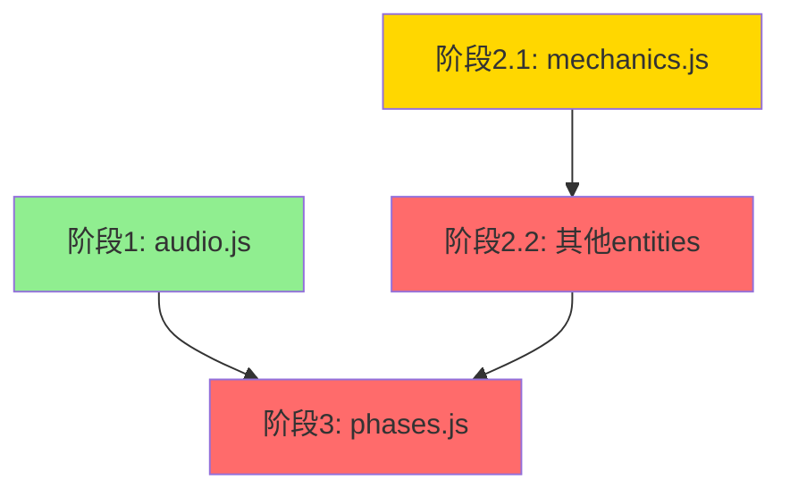

# 代码重构任务分发总结

**日期**: 2026-01-03  
**项目**: Echo Alchemist  
**分支**: refactor/code-split-pre-3d  
**基准版本**: ddc0f91 (3D之前的版本)

---

## 一、任务分发概览

| 阶段 | GitHub Issue | Manus Task ID | Agent模型 | 状态 | 预计时间 |
|------|-------------|---------------|-----------|------|---------|
| 阶段1 | [#36](https://github.com/gdszyy/echo-alchemist-v2-1766564886/issues/36) | PAZ4VLeZC6tubPWGfpzJEq | manus-1.6-lite | 🟡 进行中 | 2小时 |
| 阶段2.1 | [#37](https://github.com/gdszyy/echo-alchemist-v2-1766564886/issues/37) | 4pNcsiB4vem9xhtMy98pqz | manus-1.6-lite | ⏸️ 待开始 | 2小时 |
| 阶段2.2 | [#38](https://github.com/gdszyy/echo-alchemist-v2-1766564886/issues/38) | bsK8X3V4SmhDJ9wQtAsCTw | manus-1.6 | ⏸️ 待开始 | 6小时 |
| 阶段3 | [#39](https://github.com/gdszyy/echo-alchemist-v2-1766564886/issues/39) | 3SZgqNi7N8i2nYMahLuyLf | manus-1.6 | ⏸️ 待开始 | 8-10小时 |

**总预计时间**: 18-20小时

---

## 二、任务详情

### 阶段1: 音频系统独立（audio.js）

**任务描述**: 将SoundManager类从core.js中分离到独立的audio.js文件。

**负责Agent**: manus-1.6-lite  
**Manus任务**: [PAZ4VLeZC6tubPWGfpzJEq](https://manus.im/app/PAZ4VLeZC6tubPWGfpzJEq)  
**GitHub Issue**: [#36](https://github.com/gdszyy/echo-alchemist-v2-1766564886/issues/36)

**关键文件**:
- `src/core.js` (源文件，需修改)
- `src/audio.js` (新文件，需创建)

**验收标准**:
- ✅ audio.js包含完整的SoundManager类（15个方法）
- ✅ core.js正确导入SoundManager
- ✅ 游戏启动无报错
- ✅ 至少5种音效功能正常

**风险等级**: 🟢 低风险

---

### 阶段2.1: 创建entities/mechanics.js

**任务描述**: 从entities.js中分离游戏机制相关的类和工具函数。

**负责Agent**: manus-1.6-lite  
**Manus任务**: [4pNcsiB4vem9xhtMy98pqz](https://manus.im/app/4pNcsiB4vem9xhtMy98pqz)  
**GitHub Issue**: [#37](https://github.com/gdszyy/echo-alchemist-v2-1766564886/issues/37)

**关键文件**:
- `src/entities.js` (源文件，只读)
- `src/entities/mechanics.js` (新文件，需创建)
- `src/config.js` (依赖)

**迁移内容**:
- 6个工具函数
- 6个类（Vec2, MarbleDefinition, SpecialSlot, FortuneWheel, Peg, DropBall）

**验收标准**:
- ✅ mechanics.js包含6个工具函数
- ✅ mechanics.js包含6个类
- ✅ 正确导入CONFIG
- ✅ 正确导出所有内容
- ✅ 文件行数约1900行
- ✅ 语法检查通过

**风险等级**: 🟡 中风险

---

### 阶段2.2: 创建entities/effects.js, projectiles.js, enemy.js, player.js

**任务描述**: 创建剩余的4个实体文件并更新所有导入引用。

**负责Agent**: manus-1.6  
**Manus任务**: [bsK8X3V4SmhDJ9wQtAsCTw](https://manus.im/app/bsK8X3V4SmhDJ9wQtAsCTw)  
**GitHub Issue**: [#38](https://github.com/gdszyy/echo-alchemist-v2-1766564886/issues/38)

**前置条件**: 阶段2.1已完成

**关键文件**:
- `src/entities.js` (源文件，最后删除)
- `src/entities/effects.js` (新建，7个类，约650行)
- `src/entities/projectiles.js` (新建，7个类+1个函数，约1450行)
- `src/entities/enemy.js` (新建，Enemy类，约1300行)
- `src/entities/player.js` (新建，Player类，约700行)
- `src/core.js` (更新导入)
- `src/systems.js` (更新导入)

**验收标准**:
- ✅ 4个新文件已创建且语法正确
- ✅ effects.js包含7个类
- ✅ projectiles.js包含7个类和1个函数
- ✅ enemy.js包含Enemy类（18个方法）
- ✅ player.js包含Player类（24个方法）
- ✅ core.js和systems.js导入已更新
- ✅ 原entities.js已删除
- ✅ 完整游戏流程测试通过

**风险等级**: 🔴 高风险

---

### 阶段3: 创建phases.js并重构core.js

**任务描述**: 将core.js中的所有阶段逻辑分离到phases.js，并精简core.js。

**负责Agent**: manus-1.6  
**Manus任务**: [3SZgqNi7N8i2nYMahLuyLf](https://manus.im/app/3SZgqNi7N8i2nYMahLuyLf)  
**GitHub Issue**: [#39](https://github.com/gdszyy/echo-alchemist-v2-1766564886/issues/39)

**前置条件**: 阶段1和阶段2已完成

**关键文件**:
- `src/core.js` (重构，保留约60个方法，精简到约900行)
- `src/phases.js` (新建，约1900行)
- `src/entities/` (依赖)

**迁移内容**:
- SelectionPhase（4个方法）
- GatheringPhase（10个方法）
- CombatPhase（约70个方法）

**验收标准**:
- ✅ phases.js包含4个类
- ✅ SelectionPhase包含4个方法
- ✅ GatheringPhase包含10个方法
- ✅ CombatPhase包含约70个方法
- ✅ core.js精简到约900行
- ✅ 命运抉择阶段功能正常
- ✅ 研磨阶段功能正常（弹珠机物理）
- ✅ 战斗阶段功能正常（所有技能）
- ✅ 阶段切换流畅无卡顿

**风险等级**: 🔴 高风险

---

## 三、任务依赖关系



**依赖说明**:
- 阶段1和阶段2.1可以并行执行
- 阶段2.2依赖阶段2.1
- 阶段3依赖阶段1和阶段2.2

---

## 四、Agent配置

所有Agent已配置以下连接器:
- **GitHub**: `bbb0df76-66bd-4a24-ae4f-2aac4750d90b`
- **仓库权限**: `gdszyy/echo-alchemist-v2-1766564886`
- **工作分支**: `refactor/code-split-pre-3d`

---

## 五、验收流程

### 每个阶段完成后:
1. Agent创建PR到`refactor/code-split-pre-3d`分支
2. 项目负责人审查PR
3. 运行验收检查清单
4. 合并PR
5. 更新任务状态

### 最终验收:
1. 所有阶段完成后，运行完整的功能测试
2. 检查文件结构和行数
3. 性能测试
4. 创建PR到main分支

---

## 六、参考文档

- **平衡版方案**: `docs/refactoring_plan_balanced.md`
- **验收表**: `docs/acceptance_checklist.csv`
- **验收SOP**: `docs/refactoring_sop.md`
- **原评估报告**: `docs/code_structure_evaluation.md`

---

## 七、Manus API使用记录

### API配置
- **Base URL**: `https://api.manus.ai/v1`
- **API Key**: `sk-Uoa0Zeqa00SJseTT2HouC5azQ0QjIBgNeu4xo7Mb0Z7zyGPWo-XW4e9XYbXcnX6hAi4GXALz1zknai2QFx42pqPjtlf2`

### 任务创建记录

#### 阶段1
```bash
curl --request POST \
  --url 'https://api.manus.ai/v1/tasks' \
  --header "API_KEY: $MANUS_API_KEY" \
  --data '{
    "prompt": "...",
    "agentProfile": "manus-1.6-lite",
    "connectors": ["bbb0df76-66bd-4a24-ae4f-2aac4750d90b"]
  }'
```
**响应**: `{"task_id":"PAZ4VLeZC6tubPWGfpzJEq",...}`

#### 阶段2.1
```bash
curl --request POST \
  --url 'https://api.manus.ai/v1/tasks' \
  --header "API_KEY: $MANUS_API_KEY" \
  --data '{
    "prompt": "...",
    "agentProfile": "manus-1.6-lite",
    "connectors": ["bbb0df76-66bd-4a24-ae4f-2aac4750d90b"]
  }'
```
**响应**: `{"task_id":"4pNcsiB4vem9xhtMy98pqz",...}`

#### 阶段2.2
```bash
curl --request POST \
  --url 'https://api.manus.ai/v1/tasks' \
  --header "API_KEY: $MANUS_API_KEY" \
  --data '{
    "prompt": "...",
    "agentProfile": "manus-1.6",
    "connectors": ["bbb0df76-66bd-4a24-ae4f-2aac4750d90b"]
  }'
```
**响应**: `{"task_id":"bsK8X3V4SmhDJ9wQtAsCTw",...}`

#### 阶段3
```bash
curl --request POST \
  --url 'https://api.manus.ai/v1/tasks' \
  --header "API_KEY: $MANUS_API_KEY" \
  --data '{
    "prompt": "...",
    "agentProfile": "manus-1.6",
    "connectors": ["bbb0df76-66bd-4a24-ae4f-2aac4750d90b"]
  }'
```
**响应**: `{"task_id":"3SZgqNi7N8i2nYMahLuyLf",...}`

---

## 八、监控和跟踪

### Manus任务监控
- 阶段1: https://manus.im/app/PAZ4VLeZC6tubPWGfpzJEq
- 阶段2.1: https://manus.im/app/4pNcsiB4vem9xhtMy98pqz
- 阶段2.2: https://manus.im/app/bsK8X3V4SmhDJ9wQtAsCTw
- 阶段3: https://manus.im/app/3SZgqNi7N8i2nYMahLuyLf

### GitHub Issues监控
- 阶段1: https://github.com/gdszyy/echo-alchemist-v2-1766564886/issues/36
- 阶段2.1: https://github.com/gdszyy/echo-alchemist-v2-1766564886/issues/37
- 阶段2.2: https://github.com/gdszyy/echo-alchemist-v2-1766564886/issues/38
- 阶段3: https://github.com/gdszyy/echo-alchemist-v2-1766564886/issues/39

---

**项目负责人**: Manus AI  
**创建日期**: 2026-01-03  
**状态**: 任务已分发，等待执行
